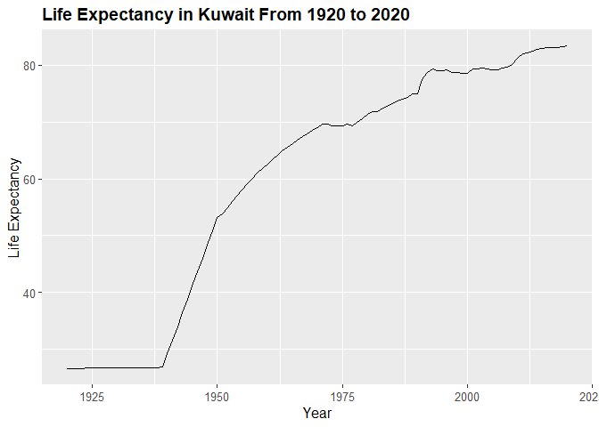
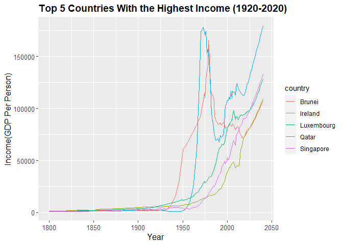
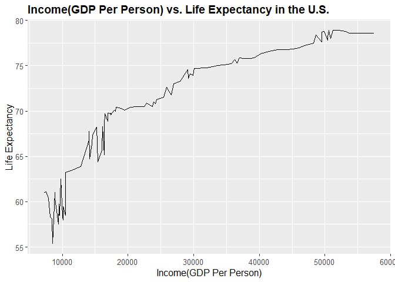

## Instructions
Answer the following questions and complete the exercises in RMarkdown. Please embed all of your code and push your final work to your repository. Your code should be organized, clean, and run free from errors. Be sure to **add your name** to the author header above. You may use any resources to answer these questions (including each other), but you may not post questions to Open Stacks or external help sites. There are 10 total questions.  

Make sure to use the formatting conventions of RMarkdown to make your report neat and clean! Your plots should use consistent aesthetics throughout. Feel free to be creative- there are many possible solutions to these questions!  

This exam is due by **12:00p on Tuesday, February 23**.  


## Load the libraries

```r
library(tidyverse)
```

```
## ── Attaching packages ─────────────────────────────────────── tidyverse 1.3.0 ──
```

```
## ✓ ggplot2 3.3.3     ✓ purrr   0.3.4
## ✓ tibble  3.0.6     ✓ dplyr   1.0.4
## ✓ tidyr   1.1.2     ✓ stringr 1.4.0
## ✓ readr   1.4.0     ✓ forcats 0.5.1
```

```
## ── Conflicts ────────────────────────────────────────── tidyverse_conflicts() ──
## x dplyr::filter() masks stats::filter()
## x dplyr::lag()    masks stats::lag()
```

```r
library(janitor)
```

```
## 
## Attaching package: 'janitor'
```

```
## The following objects are masked from 'package:stats':
## 
##     chisq.test, fisher.test
```

```r
library(here)
```

```
## here() starts at /Users/alvarezlean/Desktop/BIS15W2021_lalvarez
```

```r
options(scipen=999) #disables scientific notation when printing
```

## Gapminder
For this assignment, we are going to use data from  [gapminder](https://www.gapminder.org/). Gapminder includes information about economics, population, social issues, and life expectancy from countries all over the world. We will use three data sets, so please load all three.  

One thing to note is that the data include years beyond 2021. These are projections based on modeling done by the gapminder organization. Start by importing the data.


```r
population <- readr::read_csv("data/population_total.csv")
```

```
## 
## ── Column specification ────────────────────────────────────────────────────────
## cols(
##   .default = col_double(),
##   country = col_character()
## )
## ℹ Use `spec()` for the full column specifications.
```

```r
population
```

```
## # A tibble: 195 x 302
##    country `1800` `1801` `1802` `1803` `1804` `1805` `1806` `1807` `1808` `1809`
##    <chr>    <dbl>  <dbl>  <dbl>  <dbl>  <dbl>  <dbl>  <dbl>  <dbl>  <dbl>  <dbl>
##  1 Afghan… 3.28e6 3.28e6 3.28e6 3.28e6 3.28e6 3.28e6 3.28e6 3.28e6 3.28e6 3.28e6
##  2 Albania 4.00e5 4.02e5 4.04e5 4.05e5 4.07e5 4.09e5 4.11e5 4.13e5 4.14e5 4.16e5
##  3 Algeria 2.50e6 2.51e6 2.52e6 2.53e6 2.54e6 2.55e6 2.56e6 2.56e6 2.57e6 2.58e6
##  4 Andorra 2.65e3 2.65e3 2.65e3 2.65e3 2.65e3 2.65e3 2.65e3 2.65e3 2.65e3 2.65e3
##  5 Angola  1.57e6 1.57e6 1.57e6 1.57e6 1.57e6 1.57e6 1.57e6 1.57e6 1.57e6 1.57e6
##  6 Antigu… 3.70e4 3.70e4 3.70e4 3.70e4 3.70e4 3.70e4 3.70e4 3.70e4 3.70e4 3.70e4
##  7 Argent… 5.34e5 5.20e5 5.06e5 4.92e5 4.79e5 4.66e5 4.53e5 4.41e5 4.29e5 4.17e5
##  8 Armenia 4.13e5 4.13e5 4.13e5 4.13e5 4.13e5 4.13e5 4.13e5 4.13e5 4.13e5 4.13e5
##  9 Austra… 2.00e5 2.05e5 2.11e5 2.16e5 2.22e5 2.27e5 2.33e5 2.39e5 2.46e5 2.52e5
## 10 Austria 3.00e6 3.02e6 3.04e6 3.05e6 3.07e6 3.09e6 3.11e6 3.12e6 3.14e6 3.16e6
## # … with 185 more rows, and 291 more variables: `1810` <dbl>, `1811` <dbl>,
## #   `1812` <dbl>, `1813` <dbl>, `1814` <dbl>, `1815` <dbl>, `1816` <dbl>,
## #   `1817` <dbl>, `1818` <dbl>, `1819` <dbl>, `1820` <dbl>, `1821` <dbl>,
## #   `1822` <dbl>, `1823` <dbl>, `1824` <dbl>, `1825` <dbl>, `1826` <dbl>,
## #   `1827` <dbl>, `1828` <dbl>, `1829` <dbl>, `1830` <dbl>, `1831` <dbl>,
## #   `1832` <dbl>, `1833` <dbl>, `1834` <dbl>, `1835` <dbl>, `1836` <dbl>,
## #   `1837` <dbl>, `1838` <dbl>, `1839` <dbl>, `1840` <dbl>, `1841` <dbl>,
## #   `1842` <dbl>, `1843` <dbl>, `1844` <dbl>, `1845` <dbl>, `1846` <dbl>,
## #   `1847` <dbl>, `1848` <dbl>, `1849` <dbl>, `1850` <dbl>, `1851` <dbl>,
## #   `1852` <dbl>, `1853` <dbl>, `1854` <dbl>, `1855` <dbl>, `1856` <dbl>,
## #   `1857` <dbl>, `1858` <dbl>, `1859` <dbl>, `1860` <dbl>, `1861` <dbl>,
## #   `1862` <dbl>, `1863` <dbl>, `1864` <dbl>, `1865` <dbl>, `1866` <dbl>,
## #   `1867` <dbl>, `1868` <dbl>, `1869` <dbl>, `1870` <dbl>, `1871` <dbl>,
## #   `1872` <dbl>, `1873` <dbl>, `1874` <dbl>, `1875` <dbl>, `1876` <dbl>,
## #   `1877` <dbl>, `1878` <dbl>, `1879` <dbl>, `1880` <dbl>, `1881` <dbl>,
## #   `1882` <dbl>, `1883` <dbl>, `1884` <dbl>, `1885` <dbl>, `1886` <dbl>,
## #   `1887` <dbl>, `1888` <dbl>, `1889` <dbl>, `1890` <dbl>, `1891` <dbl>,
## #   `1892` <dbl>, `1893` <dbl>, `1894` <dbl>, `1895` <dbl>, `1896` <dbl>,
## #   `1897` <dbl>, `1898` <dbl>, `1899` <dbl>, `1900` <dbl>, `1901` <dbl>,
## #   `1902` <dbl>, `1903` <dbl>, `1904` <dbl>, `1905` <dbl>, `1906` <dbl>,
## #   `1907` <dbl>, `1908` <dbl>, `1909` <dbl>, …
```


```r
income <- readr::read_csv("data/income_per_person_gdppercapita_ppp_inflation_adjusted.csv")
```

```
## 
## ── Column specification ────────────────────────────────────────────────────────
## cols(
##   .default = col_double(),
##   country = col_character()
## )
## ℹ Use `spec()` for the full column specifications.
```

```r
income
```

```
## # A tibble: 193 x 242
##    country `1800` `1801` `1802` `1803` `1804` `1805` `1806` `1807` `1808` `1809`
##    <chr>    <dbl>  <dbl>  <dbl>  <dbl>  <dbl>  <dbl>  <dbl>  <dbl>  <dbl>  <dbl>
##  1 Afghan…    603    603    603    603    603    603    603    603    603    603
##  2 Albania    667    667    667    667    667    668    668    668    668    668
##  3 Algeria    715    716    717    718    719    720    721    722    723    724
##  4 Andorra   1200   1200   1200   1200   1210   1210   1210   1210   1220   1220
##  5 Angola     618    620    623    626    628    631    634    637    640    642
##  6 Antigu…    757    757    757    757    757    757    757    758    758    758
##  7 Argent…   1640   1640   1650   1650   1660   1660   1670   1680   1680   1690
##  8 Armenia    514    514    514    514    514    514    514    514    514    514
##  9 Austra…    817    822    826    831    836    841    845    850    855    860
## 10 Austria   1850   1850   1860   1870   1880   1880   1890   1900   1910   1920
## # … with 183 more rows, and 231 more variables: `1810` <dbl>, `1811` <dbl>,
## #   `1812` <dbl>, `1813` <dbl>, `1814` <dbl>, `1815` <dbl>, `1816` <dbl>,
## #   `1817` <dbl>, `1818` <dbl>, `1819` <dbl>, `1820` <dbl>, `1821` <dbl>,
## #   `1822` <dbl>, `1823` <dbl>, `1824` <dbl>, `1825` <dbl>, `1826` <dbl>,
## #   `1827` <dbl>, `1828` <dbl>, `1829` <dbl>, `1830` <dbl>, `1831` <dbl>,
## #   `1832` <dbl>, `1833` <dbl>, `1834` <dbl>, `1835` <dbl>, `1836` <dbl>,
## #   `1837` <dbl>, `1838` <dbl>, `1839` <dbl>, `1840` <dbl>, `1841` <dbl>,
## #   `1842` <dbl>, `1843` <dbl>, `1844` <dbl>, `1845` <dbl>, `1846` <dbl>,
## #   `1847` <dbl>, `1848` <dbl>, `1849` <dbl>, `1850` <dbl>, `1851` <dbl>,
## #   `1852` <dbl>, `1853` <dbl>, `1854` <dbl>, `1855` <dbl>, `1856` <dbl>,
## #   `1857` <dbl>, `1858` <dbl>, `1859` <dbl>, `1860` <dbl>, `1861` <dbl>,
## #   `1862` <dbl>, `1863` <dbl>, `1864` <dbl>, `1865` <dbl>, `1866` <dbl>,
## #   `1867` <dbl>, `1868` <dbl>, `1869` <dbl>, `1870` <dbl>, `1871` <dbl>,
## #   `1872` <dbl>, `1873` <dbl>, `1874` <dbl>, `1875` <dbl>, `1876` <dbl>,
## #   `1877` <dbl>, `1878` <dbl>, `1879` <dbl>, `1880` <dbl>, `1881` <dbl>,
## #   `1882` <dbl>, `1883` <dbl>, `1884` <dbl>, `1885` <dbl>, `1886` <dbl>,
## #   `1887` <dbl>, `1888` <dbl>, `1889` <dbl>, `1890` <dbl>, `1891` <dbl>,
## #   `1892` <dbl>, `1893` <dbl>, `1894` <dbl>, `1895` <dbl>, `1896` <dbl>,
## #   `1897` <dbl>, `1898` <dbl>, `1899` <dbl>, `1900` <dbl>, `1901` <dbl>,
## #   `1902` <dbl>, `1903` <dbl>, `1904` <dbl>, `1905` <dbl>, `1906` <dbl>,
## #   `1907` <dbl>, `1908` <dbl>, `1909` <dbl>, …
```


```r
life_expectancy <- readr::read_csv("data/life_expectancy_years.csv")
```

```
## 
## ── Column specification ────────────────────────────────────────────────────────
## cols(
##   .default = col_double(),
##   country = col_character()
## )
## ℹ Use `spec()` for the full column specifications.
```

```r
life_expectancy
```

```
## # A tibble: 187 x 302
##    country `1800` `1801` `1802` `1803` `1804` `1805` `1806` `1807` `1808` `1809`
##    <chr>    <dbl>  <dbl>  <dbl>  <dbl>  <dbl>  <dbl>  <dbl>  <dbl>  <dbl>  <dbl>
##  1 Afghan…   28.2   28.2   28.2   28.2   28.2   28.2   28.1   28.1   28.1   28.1
##  2 Albania   35.4   35.4   35.4   35.4   35.4   35.4   35.4   35.4   35.4   35.4
##  3 Algeria   28.8   28.8   28.8   28.8   28.8   28.8   28.8   28.8   28.8   28.8
##  4 Andorra   NA     NA     NA     NA     NA     NA     NA     NA     NA     NA  
##  5 Angola    27     27     27     27     27     27     27     27     27     27  
##  6 Antigu…   33.5   33.5   33.5   33.5   33.5   33.5   33.5   33.5   33.5   33.5
##  7 Argent…   33.2   33.2   33.2   33.2   33.2   33.2   33.2   33.2   33.2   33.2
##  8 Armenia   34     34     34     34     34     34     34     34     34     34  
##  9 Austra…   34     34     34     34     34     34     34     34     34     34  
## 10 Austria   34.4   34.4   34.4   34.4   34.4   34.4   34.4   34.4   34.4   34.4
## # … with 177 more rows, and 291 more variables: `1810` <dbl>, `1811` <dbl>,
## #   `1812` <dbl>, `1813` <dbl>, `1814` <dbl>, `1815` <dbl>, `1816` <dbl>,
## #   `1817` <dbl>, `1818` <dbl>, `1819` <dbl>, `1820` <dbl>, `1821` <dbl>,
## #   `1822` <dbl>, `1823` <dbl>, `1824` <dbl>, `1825` <dbl>, `1826` <dbl>,
## #   `1827` <dbl>, `1828` <dbl>, `1829` <dbl>, `1830` <dbl>, `1831` <dbl>,
## #   `1832` <dbl>, `1833` <dbl>, `1834` <dbl>, `1835` <dbl>, `1836` <dbl>,
## #   `1837` <dbl>, `1838` <dbl>, `1839` <dbl>, `1840` <dbl>, `1841` <dbl>,
## #   `1842` <dbl>, `1843` <dbl>, `1844` <dbl>, `1845` <dbl>, `1846` <dbl>,
## #   `1847` <dbl>, `1848` <dbl>, `1849` <dbl>, `1850` <dbl>, `1851` <dbl>,
## #   `1852` <dbl>, `1853` <dbl>, `1854` <dbl>, `1855` <dbl>, `1856` <dbl>,
## #   `1857` <dbl>, `1858` <dbl>, `1859` <dbl>, `1860` <dbl>, `1861` <dbl>,
## #   `1862` <dbl>, `1863` <dbl>, `1864` <dbl>, `1865` <dbl>, `1866` <dbl>,
## #   `1867` <dbl>, `1868` <dbl>, `1869` <dbl>, `1870` <dbl>, `1871` <dbl>,
## #   `1872` <dbl>, `1873` <dbl>, `1874` <dbl>, `1875` <dbl>, `1876` <dbl>,
## #   `1877` <dbl>, `1878` <dbl>, `1879` <dbl>, `1880` <dbl>, `1881` <dbl>,
## #   `1882` <dbl>, `1883` <dbl>, `1884` <dbl>, `1885` <dbl>, `1886` <dbl>,
## #   `1887` <dbl>, `1888` <dbl>, `1889` <dbl>, `1890` <dbl>, `1891` <dbl>,
## #   `1892` <dbl>, `1893` <dbl>, `1894` <dbl>, `1895` <dbl>, `1896` <dbl>,
## #   `1897` <dbl>, `1898` <dbl>, `1899` <dbl>, `1900` <dbl>, `1901` <dbl>,
## #   `1902` <dbl>, `1903` <dbl>, `1904` <dbl>, `1905` <dbl>, `1906` <dbl>,
## #   `1907` <dbl>, `1908` <dbl>, `1909` <dbl>, …
```

1. (3 points) Once you have an idea of the structure of the data, please make each data set tidy and store them as new objects. You will need both the original and tidy data!

```r
summary(population)
```

```
##    country               1800                1801                1802          
##  Length:195         Min.   :      905   Min.   :      905   Min.   :      905  
##  Class :character   1st Qu.:   128500   1st Qu.:   128500   1st Qu.:   128500  
##  Mode  :character   Median :   637000   Median :   637000   Median :   637000  
##                     Mean   :  5038229   Mean   :  5055872   Mean   :  5074643  
##                     3rd Qu.:  2200000   3rd Qu.:  2200000   3rd Qu.:  2195000  
##                     Max.   :330000000   Max.   :332000000   Max.   :333000000  
##       1803                1804                1805          
##  Min.   :      905   Min.   :      905   Min.   :      905  
##  1st Qu.:   129000   1st Qu.:   129000   1st Qu.:   129000  
##  Median :   637000   Median :   637000   Median :   637000  
##  Mean   :  5092072   Mean   :  5105055   Mean   :  5128710  
##  3rd Qu.:  2195000   3rd Qu.:  2195000   3rd Qu.:  2175000  
##  Max.   :335000000   Max.   :336000000   Max.   :338000000  
##       1806                1807                1808          
##  Min.   :      905   Min.   :      905   Min.   :      905  
##  1st Qu.:   127500   1st Qu.:   127000   1st Qu.:   127000  
##  Median :   637000   Median :   637000   Median :   637000  
##  Mean   :  5143516   Mean   :  5167424   Mean   :  5186405  
##  3rd Qu.:  2145000   3rd Qu.:  2145000   3rd Qu.:  2145000  
##  Max.   :339000000   Max.   :341000000   Max.   :343000000  
##       1809                1810                1811          
##  Min.   :      905   Min.   :      905   Min.   :      905  
##  1st Qu.:   127000   1st Qu.:   127000   1st Qu.:   127000  
##  Median :   637000   Median :   639000   Median :   655000  
##  Mean   :  5199982   Mean   :  5232967   Mean   :  5254824  
##  3rd Qu.:  2145000   3rd Qu.:  2145000   3rd Qu.:  2145000  
##  Max.   :344000000   Max.   :347000000   Max.   :349000000  
##       1812                1813                1814          
##  Min.   :      905   Min.   :      905   Min.   :      905  
##  1st Qu.:   127000   1st Qu.:   127000   1st Qu.:   125000  
##  Median :   671000   Median :   688000   Median :   705000  
##  Mean   :  5294767   Mean   :  5325674   Mean   :  5361654  
##  3rd Qu.:  2145000   3rd Qu.:  2145000   3rd Qu.:  2155000  
##  Max.   :353000000   Max.   :356000000   Max.   :359000000  
##       1815                1816                1817          
##  Min.   :      905   Min.   :      905   Min.   :      905  
##  1st Qu.:   123000   1st Qu.:   121000   1st Qu.:   120000  
##  Median :   713000   Median :   713000   Median :   713000  
##  Mean   :  5398080   Mean   :  5440271   Mean   :  5472701  
##  3rd Qu.:  2170000   3rd Qu.:  2165000   3rd Qu.:  2155000  
##  Max.   :363000000   Max.   :367000000   Max.   :370000000  
##       1818                1819                1820          
##  Min.   :      905   Min.   :      905   Min.   :      905  
##  1st Qu.:   120000   1st Qu.:   120000   1st Qu.:   120000  
##  Median :   713000   Median :   714000   Median :   719000  
##  Mean   :  5517194   Mean   :  5550374   Mean   :  5588640  
##  3rd Qu.:  2145000   3rd Qu.:  2150000   3rd Qu.:  2165000  
##  Max.   :374000000   Max.   :377000000   Max.   :380000000  
##       1821                1822                1823          
##  Min.   :      905   Min.   :      905   Min.   :      905  
##  1st Qu.:   120500   1st Qu.:   121000   1st Qu.:   122000  
##  Median :   728000   Median :   736000   Median :   742000  
##  Mean   :  5627718   Mean   :  5661860   Mean   :  5701340  
##  3rd Qu.:  2185000   3rd Qu.:  2215000   3rd Qu.:  2250000  
##  Max.   :384000000   Max.   :386000000   Max.   :389000000  
##       1824                1825                1826          
##  Min.   :      905   Min.   :      905   Min.   :      905  
##  1st Qu.:   122500   1st Qu.:   123000   1st Qu.:   123500  
##  Median :   749000   Median :   756000   Median :   762000  
##  Mean   :  5734966   Mean   :  5774826   Mean   :  5816081  
##  3rd Qu.:  2285000   3rd Qu.:  2310000   3rd Qu.:  2335000  
##  Max.   :392000000   Max.   :395000000   Max.   :398000000  
##       1827                1828                1829          
##  Min.   :      905   Min.   :      905   Min.   :      905  
##  1st Qu.:   123000   1st Qu.:   122000   1st Qu.:   119500  
##  Median :   768000   Median :   775000   Median :   782000  
##  Mean   :  5853201   Mean   :  5894272   Mean   :  5936815  
##  3rd Qu.:  2370000   3rd Qu.:  2395000   3rd Qu.:  2420000  
##  Max.   :400000000   Max.   :403000000   Max.   :406000000  
##       1830                1831                1832          
##  Min.   :      905   Min.   :      905   Min.   :      905  
##  1st Qu.:   118000   1st Qu.:   116000   1st Qu.:   115000  
##  Median :   789000   Median :   789000   Median :   795000  
##  Mean   :  5967640   Mean   :  5999721   Mean   :  6031314  
##  3rd Qu.:  2445000   3rd Qu.:  2470000   3rd Qu.:  2495000  
##  Max.   :407000000   Max.   :409000000   Max.   :410000000  
##       1833                1834                1835          
##  Min.   :      905   Min.   :      905   Min.   :      905  
##  1st Qu.:   114000   1st Qu.:   113500   1st Qu.:   113000  
##  Median :   802000   Median :   810000   Median :   817000  
##  Mean   :  6057897   Mean   :  6086100   Mean   :  6113028  
##  3rd Qu.:  2520000   3rd Qu.:  2550000   3rd Qu.:  2570000  
##  Max.   :410000000   Max.   :410000000   Max.   :410000000  
##       1836                1837                1838          
##  Min.   :      905   Min.   :      905   Min.   :      905  
##  1st Qu.:   112500   1st Qu.:   113500   1st Qu.:   115500  
##  Median :   825000   Median :   823000   Median :   810000  
##  Mean   :  6146867   Mean   :  6174688   Mean   :  6203668  
##  3rd Qu.:  2595000   3rd Qu.:  2610000   3rd Qu.:  2630000  
##  Max.   :411000000   Max.   :411000000   Max.   :411000000  
##       1839                1840                1841          
##  Min.   :      905   Min.   :      905   Min.   :      905  
##  1st Qu.:   117500   1st Qu.:   120500   1st Qu.:   123500  
##  Median :   805000   Median :   818000   Median :   831000  
##  Mean   :  6236324   Mean   :  6265864   Mean   :  6288498  
##  3rd Qu.:  2645000   3rd Qu.:  2665000   3rd Qu.:  2680000  
##  Max.   :412000000   Max.   :412000000   Max.   :412000000  
##       1842                1843                1844          
##  Min.   :      905   Min.   :      905   Min.   :      905  
##  1st Qu.:   127000   1st Qu.:   129500   1st Qu.:   129500  
##  Median :   845000   Median :   859000   Median :   887000  
##  Mean   :  6316663   Mean   :  6344308   Mean   :  6374099  
##  3rd Qu.:  2700000   3rd Qu.:  2715000   3rd Qu.:  2735000  
##  Max.   :412000000   Max.   :412000000   Max.   :412000000  
##       1845                1846                1847          
##  Min.   :      905   Min.   :      905   Min.   :      905  
##  1st Qu.:   130000   1st Qu.:   132000   1st Qu.:   133500  
##  Median :   895000   Median :   904000   Median :   914000  
##  Mean   :  6402963   Mean   :  6431975   Mean   :  6462558  
##  3rd Qu.:  2755000   3rd Qu.:  2825000   3rd Qu.:  2825000  
##  Max.   :412000000   Max.   :412000000   Max.   :412000000  
##       1848                1849                1850          
##  Min.   :      905   Min.   :      905   Min.   :      905  
##  1st Qu.:   134500   1st Qu.:   135500   1st Qu.:   136500  
##  Median :   922000   Median :   930000   Median :   937000  
##  Mean   :  6492695   Mean   :  6518678   Mean   :  6543826  
##  3rd Qu.:  2860000   3rd Qu.:  2885000   3rd Qu.:  2905000  
##  Max.   :412000000   Max.   :411000000   Max.   :410000000  
##       1851                1852                1853          
##  Min.   :      905   Min.   :      905   Min.   :      905  
##  1st Qu.:   138500   1st Qu.:   143000   1st Qu.:   148000  
##  Median :   946000   Median :   954000   Median :   963000  
##  Mean   :  6560809   Mean   :  6572626   Mean   :  6580616  
##  3rd Qu.:  2925000   3rd Qu.:  2945000   3rd Qu.:  2965000  
##  Max.   :408000000   Max.   :405000000   Max.   :401000000  
##       1854                1855                1856          
##  Min.   :      905   Min.   :      906   Min.   :      906  
##  1st Qu.:   152500   1st Qu.:   154500   1st Qu.:   156000  
##  Median :   972000   Median :   981000   Median :   989000  
##  Mean   :  6593709   Mean   :  6601445   Mean   :  6614979  
##  3rd Qu.:  2975000   3rd Qu.:  2985000   3rd Qu.:  3015000  
##  Max.   :398000000   Max.   :394000000   Max.   :391000000  
##       1857                1858                1859          
##  Min.   :      906   Min.   :      906   Min.   :      906  
##  1st Qu.:   157500   1st Qu.:   158500   1st Qu.:   160000  
##  Median :  1010000   Median :  1020000   Median :  1030000  
##  Mean   :  6617604   Mean   :  6633016   Mean   :  6647610  
##  3rd Qu.:  3045000   3rd Qu.:  3075000   3rd Qu.:  3110000  
##  Max.   :387000000   Max.   :384000000   Max.   :381000000  
##       1860                1861                1862          
##  Min.   :      906   Min.   :      906   Min.   :      906  
##  1st Qu.:   161000   1st Qu.:   162500   1st Qu.:   163500  
##  Median :  1040000   Median :  1040000   Median :  1050000  
##  Mean   :  6661632   Mean   :  6682475   Mean   :  6698291  
##  3rd Qu.:  3140000   3rd Qu.:  3175000   3rd Qu.:  3205000  
##  Max.   :378000000   Max.   :376000000   Max.   :373000000  
##       1863                1864                1865          
##  Min.   :      906   Min.   :      906   Min.   :      907  
##  1st Qu.:   170500   1st Qu.:   178000   1st Qu.:   180500  
##  Median :  1060000   Median :  1060000   Median :  1070000  
##  Mean   :  6723903   Mean   :  6745063   Mean   :  6766812  
##  3rd Qu.:  3235000   3rd Qu.:  3270000   3rd Qu.:  3300000  
##  Max.   :372000000   Max.   :370000000   Max.   :368000000  
##       1866                1867                1868          
##  Min.   :      907   Min.   :      907   Min.   :      907  
##  1st Qu.:   181500   1st Qu.:   182000   1st Qu.:   183000  
##  Median :  1080000   Median :  1090000   Median :  1100000  
##  Mean   :  6789713   Mean   :  6811864   Mean   :  6835001  
##  3rd Qu.:  3335000   3rd Qu.:  3370000   3rd Qu.:  3400000  
##  Max.   :366000000   Max.   :364000000   Max.   :362000000  
##       1869                1870                1871          
##  Min.   :      907   Min.   :      907   Min.   :      907  
##  1st Qu.:   185500   1st Qu.:   188000   1st Qu.:   190500  
##  Median :  1110000   Median :  1120000   Median :  1130000  
##  Mean   :  6863545   Mean   :  6893385   Mean   :  6926927  
##  3rd Qu.:  3435000   3rd Qu.:  3470000   3rd Qu.:  3505000  
##  Max.   :361000000   Max.   :360000000   Max.   :360000000  
##       1872                1873                1874          
##  Min.   :      907   Min.   :      907   Min.   :      908  
##  1st Qu.:   193000   1st Qu.:   193500   1st Qu.:   194000  
##  Median :  1140000   Median :  1150000   Median :  1160000  
##  Mean   :  6963235   Mean   :  7003934   Mean   :  7045028  
##  3rd Qu.:  3540000   3rd Qu.:  3575000   3rd Qu.:  3610000  
##  Max.   :361000000   Max.   :362000000   Max.   :363000000  
##       1875                1876                1877          
##  Min.   :      908   Min.   :      908   Min.   :      908  
##  1st Qu.:   195000   1st Qu.:   196500   1st Qu.:   198000  
##  Median :  1170000   Median :  1190000   Median :  1200000  
##  Mean   :  7082339   Mean   :  7123451   Mean   :  7162378  
##  3rd Qu.:  3650000   3rd Qu.:  3680000   3rd Qu.:  3720000  
##  Max.   :364000000   Max.   :365000000   Max.   :366000000  
##       1878                1879                1880          
##  Min.   :      908   Min.   :      908   Min.   :      908  
##  1st Qu.:   200000   1st Qu.:   201500   1st Qu.:   203500  
##  Median :  1220000   Median :  1220000   Median :  1230000  
##  Mean   :  7204484   Mean   :  7248380   Mean   :  7293329  
##  3rd Qu.:  3720000   3rd Qu.:  3745000   3rd Qu.:  3800000  
##  Max.   :367000000   Max.   :368000000   Max.   :369000000  
##       1881                1882                1883          
##  Min.   :      908   Min.   :      908   Min.   :      908  
##  1st Qu.:   205000   1st Qu.:   206500   1st Qu.:   208500  
##  Median :  1240000   Median :  1250000   Median :  1260000  
##  Mean   :  7345366   Mean   :  7395656   Mean   :  7448344  
##  3rd Qu.:  3870000   3rd Qu.:  3910000   3rd Qu.:  3950000  
##  Max.   :370000000   Max.   :371000000   Max.   :372000000  
##       1884                1885                1886          
##  Min.   :      909   Min.   :      909   Min.   :      909  
##  1st Qu.:   212000   1st Qu.:   215500   1st Qu.:   220500  
##  Median :  1270000   Median :  1300000   Median :  1330000  
##  Mean   :  7507391   Mean   :  7565904   Mean   :  7621718  
##  3rd Qu.:  3990000   3rd Qu.:  4030000   3rd Qu.:  4070000  
##  Max.   :374000000   Max.   :375000000   Max.   :376000000  
##       1887                1888                1889          
##  Min.   :      909   Min.   :      909   Min.   :      909  
##  1st Qu.:   225000   1st Qu.:   230000   1st Qu.:   235000  
##  Median :  1350000   Median :  1370000   Median :  1380000  
##  Mean   :  7677260   Mean   :  7743123   Mean   :  7799709  
##  3rd Qu.:  4110000   3rd Qu.:  4150000   3rd Qu.:  4195000  
##  Max.   :377000000   Max.   :379000000   Max.   :380000000  
##       1890                1891                1892          
##  Min.   :      909   Min.   :      909   Min.   :      909  
##  1st Qu.:   239500   1st Qu.:   242500   1st Qu.:   245500  
##  Median :  1390000   Median :  1390000   Median :  1390000  
##  Mean   :  7859939   Mean   :  7911962   Mean   :  7966124  
##  3rd Qu.:  4235000   3rd Qu.:  4275000   3rd Qu.:  4290000  
##  Max.   :382000000   Max.   :383000000   Max.   :385000000  
##       1893                1894                1895          
##  Min.   :      910   Min.   :      910   Min.   :      910  
##  1st Qu.:   249000   1st Qu.:   253500   1st Qu.:   256500  
##  Median :  1390000   Median :  1400000   Median :  1410000  
##  Mean   :  8021656   Mean   :  8073309   Mean   :  8129882  
##  3rd Qu.:  4300000   3rd Qu.:  4315000   3rd Qu.:  4305000  
##  Max.   :387000000   Max.   :389000000   Max.   :391000000  
##       1896                1897                1898          
##  Min.   :      910   Min.   :      910   Min.   :      910  
##  1st Qu.:   259000   1st Qu.:   262500   1st Qu.:   265000  
##  Median :  1420000   Median :  1430000   Median :  1440000  
##  Mean   :  8187026   Mean   :  8239609   Mean   :  8297266  
##  3rd Qu.:  4285000   3rd Qu.:  4295000   3rd Qu.:  4350000  
##  Max.   :393000000   Max.   :395000000   Max.   :397000000  
##       1899                1900                1901          
##  Min.   :      910   Min.   :      910   Min.   :      910  
##  1st Qu.:   268500   1st Qu.:   271000   1st Qu.:   271000  
##  Median :  1460000   Median :  1470000   Median :  1480000  
##  Mean   :  8359438   Mean   :  8425604   Mean   :  8489851  
##  3rd Qu.:  4375000   3rd Qu.:  4350000   3rd Qu.:  4330000  
##  Max.   :399000000   Max.   :402000000   Max.   :404000000  
##       1902                1903                1904          
##  Min.   :      910   Min.   :      911   Min.   :      911  
##  1st Qu.:   272000   1st Qu.:   276500   1st Qu.:   281000  
##  Median :  1500000   Median :  1500000   Median :  1520000  
##  Mean   :  8560671   Mean   :  8633293   Mean   :  8710535  
##  3rd Qu.:  4330000   3rd Qu.:  4365000   3rd Qu.:  4405000  
##  Max.   :406000000   Max.   :408000000   Max.   :411000000  
##       1905                1906                1907          
##  Min.   :      911   Min.   :      911   Min.   :      911  
##  1st Qu.:   286000   1st Qu.:   290500   1st Qu.:   292500  
##  Median :  1540000   Median :  1550000   Median :  1540000  
##  Mean   :  8785832   Mean   :  8861704   Mean   :  8943411  
##  3rd Qu.:  4490000   3rd Qu.:  4580000   3rd Qu.:  4670000  
##  Max.   :413000000   Max.   :415000000   Max.   :418000000  
##       1908                1909                1910          
##  Min.   :      911   Min.   :      911   Min.   :      911  
##  1st Qu.:   297000   1st Qu.:   302500   1st Qu.:   306500  
##  Median :  1530000   Median :  1520000   Median :  1520000  
##  Mean   :  9019978   Mean   :  9094033   Mean   :  9167826  
##  3rd Qu.:  4760000   3rd Qu.:  4800000   3rd Qu.:  4825000  
##  Max.   :420000000   Max.   :423000000   Max.   :426000000  
##       1911                1912                1913          
##  Min.   :      911   Min.   :      912   Min.   :      912  
##  1st Qu.:   305000   1st Qu.:   304000   1st Qu.:   305500  
##  Median :  1520000   Median :  1530000   Median :  1550000  
##  Mean   :  9235432   Mean   :  9302106   Mean   :  9368667  
##  3rd Qu.:  4850000   3rd Qu.:  4845000   3rd Qu.:  4845000  
##  Max.   :430000000   Max.   :434000000   Max.   :439000000  
##       1914                1915                1916          
##  Min.   :      912   Min.   :      912   Min.   :      912  
##  1st Qu.:   306500   1st Qu.:   309000   1st Qu.:   310000  
##  Median :  1570000   Median :  1580000   Median :  1590000  
##  Mean   :  9432415   Mean   :  9498460   Mean   :  9564826  
##  3rd Qu.:  4845000   3rd Qu.:  4855000   3rd Qu.:  4895000  
##  Max.   :444000000   Max.   :449000000   Max.   :454000000  
##       1917                1918                1919          
##  Min.   :      912   Min.   :      912   Min.   :      912  
##  1st Qu.:   310500   1st Qu.:   311500   1st Qu.:   313000  
##  Median :  1600000   Median :  1610000   Median :  1630000  
##  Mean   :  9630391   Mean   :  9697385   Mean   :  9766291  
##  3rd Qu.:  4945000   3rd Qu.:  5015000   3rd Qu.:  5095000  
##  Max.   :459000000   Max.   :464000000   Max.   :468000000  
##       1920                1921                1922          
##  Min.   :      912   Min.   :      912   Min.   :      912  
##  1st Qu.:   315500   1st Qu.:   318000   1st Qu.:   321500  
##  Median :  1640000   Median :  1660000   Median :  1680000  
##  Mean   :  9843719   Mean   :  9925046   Mean   : 10010265  
##  3rd Qu.:  5180000   3rd Qu.:  5275000   3rd Qu.:  5330000  
##  Max.   :472000000   Max.   :475000000   Max.   :478000000  
##       1923                1924                1925          
##  Min.   :      912   Min.   :      912   Min.   :      912  
##  1st Qu.:   325500   1st Qu.:   329000   1st Qu.:   333500  
##  Median :  1710000   Median :  1730000   Median :  1760000  
##  Mean   : 10093537   Mean   : 10186294   Mean   : 10277638  
##  3rd Qu.:  5375000   3rd Qu.:  5425000   3rd Qu.:  5470000  
##  Max.   :479000000   Max.   :481000000   Max.   :483000000  
##       1926                1927                1928          
##  Min.   :      912   Min.   :      912   Min.   :      912  
##  1st Qu.:   337500   1st Qu.:   341000   1st Qu.:   345500  
##  Median :  1780000   Median :  1800000   Median :  1820000  
##  Mean   : 10361037   Mean   : 10454114   Mean   : 10550466  
##  3rd Qu.:  5515000   3rd Qu.:  5565000   3rd Qu.:  5615000  
##  Max.   :484000000   Max.   :486000000   Max.   :488000000  
##       1929                1930                1931          
##  Min.   :      912   Min.   :      912   Min.   :      912  
##  1st Qu.:   350000   1st Qu.:   355500   1st Qu.:   361000  
##  Median :  1840000   Median :  1870000   Median :  1880000  
##  Mean   : 10651250   Mean   : 10749049   Mean   : 10852892  
##  3rd Qu.:  5695000   3rd Qu.:  5775000   3rd Qu.:  5845000  
##  Max.   :490000000   Max.   :492000000   Max.   :495000000  
##       1932                1933                1934          
##  Min.   :      912   Min.   :      912   Min.   :      912  
##  1st Qu.:   367500   1st Qu.:   374500   1st Qu.:   382000  
##  Median :  1920000   Median :  1960000   Median :  1980000  
##  Mean   : 10964595   Mean   : 11073418   Mean   : 11187659  
##  3rd Qu.:  5915000   3rd Qu.:  5985000   3rd Qu.:  6055000  
##  Max.   :497000000   Max.   :500000000   Max.   :503000000  
##       1935                1936                1937          
##  Min.   :      912   Min.   :      912   Min.   :      912  
##  1st Qu.:   389500   1st Qu.:   398500   1st Qu.:   407500  
##  Median :  2010000   Median :  2030000   Median :  2050000  
##  Mean   : 11301979   Mean   : 11416411   Mean   : 11537737  
##  3rd Qu.:  6125000   3rd Qu.:  6195000   3rd Qu.:  6260000  
##  Max.   :506000000   Max.   :509000000   Max.   :512000000  
##       1938                1939                1940          
##  Min.   :      912   Min.   :      912   Min.   :      912  
##  1st Qu.:   413500   1st Qu.:   417500   1st Qu.:   417500  
##  Median :  2080000   Median :  2100000   Median :  2120000  
##  Mean   : 11656526   Mean   : 11770403   Mean   : 11881916  
##  3rd Qu.:  6320000   3rd Qu.:  6385000   3rd Qu.:  6450000  
##  Max.   :515000000   Max.   :518000000   Max.   :521000000  
##       1941                1942                1943          
##  Min.   :      912   Min.   :      912   Min.   :      912  
##  1st Qu.:   416000   1st Qu.:   418500   1st Qu.:   421500  
##  Median :  2140000   Median :  2150000   Median :  2180000  
##  Mean   : 11982732   Mean   : 12082436   Mean   : 12174120  
##  3rd Qu.:  6545000   3rd Qu.:  6660000   3rd Qu.:  6745000  
##  Max.   :524000000   Max.   :527000000   Max.   :530000000  
##       1944                1945                1946          
##  Min.   :      912   Min.   :      912   Min.   :      912  
##  1st Qu.:   424500   1st Qu.:   427500   1st Qu.:   430500  
##  Median :  2220000   Median :  2260000   Median :  2300000  
##  Mean   : 12261134   Mean   : 12353262   Mean   : 12448431  
##  3rd Qu.:  6815000   3rd Qu.:  6900000   3rd Qu.:  7045000  
##  Max.   :532000000   Max.   :535000000   Max.   :538000000  
##       1947                1948                1949          
##  Min.   :      912   Min.   :      912   Min.   :      912  
##  1st Qu.:   430500   1st Qu.:   440000   1st Qu.:   454000  
##  Median :  2350000   Median :  2390000   Median :  2440000  
##  Mean   : 12544251   Mean   : 12649006   Mean   : 12775571  
##  3rd Qu.:  7140000   3rd Qu.:  7235000   3rd Qu.:  7335000  
##  Max.   :541000000   Max.   :544000000   Max.   :548000000  
##       1950                1951                1952          
##  Min.   :      906   Min.   :      883   Min.   :      883  
##  1st Qu.:   464500   1st Qu.:   469000   1st Qu.:   474000  
##  Median :  2480000   Median :  2500000   Median :  2530000  
##  Mean   : 12935097   Mean   : 13176854   Mean   : 13419535  
##  3rd Qu.:  7450000   3rd Qu.:  7505000   3rd Qu.:  7525000  
##  Max.   :554000000   Max.   :570000000   Max.   :583000000  
##       1953                1954                1955          
##  Min.   :      890   Min.   :      899   Min.   :      900  
##  1st Qu.:   479000   1st Qu.:   484000   1st Qu.:   490000  
##  Median :  2590000   Median :  2610000   Median :  2640000  
##  Mean   : 13657720   Mean   : 13901826   Mean   : 14139348  
##  3rd Qu.:  7555000   3rd Qu.:  7640000   3rd Qu.:  7840000  
##  Max.   :593000000   Max.   :603000000   Max.   :612000000  
##       1956                1957                1958          
##  Min.   :      909   Min.   :      908   Min.   :      905  
##  1st Qu.:   503000   1st Qu.:   517000   1st Qu.:   532000  
##  Median :  2720000   Median :  2810000   Median :  2850000  
##  Mean   : 14389681   Mean   : 14652702   Mean   : 14914714  
##  3rd Qu.:  7940000   3rd Qu.:  8005000   3rd Qu.:  8085000  
##  Max.   :621000000   Max.   :631000000   Max.   :640000000  
##       1959                1960                1961          
##  Min.   :      905   Min.   :      904   Min.   :      904  
##  1st Qu.:   546500   1st Qu.:   562000   1st Qu.:   570500  
##  Median :  2930000   Median :  3000000   Median :  3060000  
##  Mean   : 15189836   Mean   : 15473214   Mean   : 15761233  
##  3rd Qu.:  8240000   3rd Qu.:  8400000   3rd Qu.:  8625000  
##  Max.   :650000000   Max.   :660000000   Max.   :671000000  
##       1962                1963                1964          
##  Min.   :      901   Min.   :      898   Min.   :      877  
##  1st Qu.:   578500   1st Qu.:   585500   1st Qu.:   594000  
##  Median :  3120000   Median :  3180000   Median :  3250000  
##  Mean   : 16055951   Mean   : 16363208   Mean   : 16680203  
##  3rd Qu.:  8815000   3rd Qu.:  9010000   3rd Qu.:  9310000  
##  Max.   :682000000   Max.   :694000000   Max.   :708000000  
##       1965                1966                1967          
##  Min.   :      853   Min.   :      814   Min.   :      766  
##  1st Qu.:   603000   1st Qu.:   613500   1st Qu.:   625500  
##  Median :  3310000   Median :  3370000   Median :  3430000  
##  Mean   : 17017910   Mean   : 17363647   Mean   : 17727175  
##  3rd Qu.:  9530000   3rd Qu.:  9805000   3rd Qu.:  9910000  
##  Max.   :724000000   Max.   :742000000   Max.   :763000000  
##       1968                1969                1970          
##  Min.   :      711   Min.   :      670   Min.   :      649  
##  1st Qu.:   656500   1st Qu.:   690500   1st Qu.:   705000  
##  Median :  3500000   Median :  3580000   Median :  3670000  
##  Mean   : 18098461   Mean   : 18469813   Mean   : 18858702  
##  3rd Qu.: 10055000   3rd Qu.: 10125000   3rd Qu.: 10350000  
##  Max.   :784000000   Max.   :806000000   Max.   :828000000  
##       1971                1972                1973          
##  Min.   :      645   Min.   :      661   Min.   :      685  
##  1st Qu.:   716000   1st Qu.:   727500   1st Qu.:   738000  
##  Median :  3770000   Median :  3850000   Median :  3910000  
##  Mean   : 19236839   Mean   : 19622929   Mean   : 20008507  
##  3rd Qu.: 10500000   3rd Qu.: 10800000   3rd Qu.: 11150000  
##  Max.   :849000000   Max.   :869000000   Max.   :889000000  
##       1974                1975                1976          
##  Min.   :      708   Min.   :      724   Min.   :      730  
##  1st Qu.:   748000   1st Qu.:   756000   1st Qu.:   770000  
##  Median :  3990000   Median :  4010000   Median :  4170000  
##  Mean   : 20399038   Mean   : 20785836   Mean   : 21176135  
##  3rd Qu.: 11500000   3rd Qu.: 11900000   3rd Qu.: 12300000  
##  Max.   :908000000   Max.   :926000000   Max.   :943000000  
##       1977                1978                1979          
##  Min.   :      730   Min.   :      725   Min.   :      722  
##  1st Qu.:   786500   1st Qu.:   833500   1st Qu.:   898500  
##  Median :  4260000   Median :  4340000   Median :  4420000  
##  Mean   : 21543941   Mean   : 21927694   Mean   : 22317685  
##  3rd Qu.: 12650000   3rd Qu.: 13000000   3rd Qu.: 13350000  
##  Max.   :958000000   Max.   :972000000   Max.   :986000000  
##       1980                 1981                 1982           
##  Min.   :       725   Min.   :       723   Min.   :       725  
##  1st Qu.:    932000   1st Qu.:    954000   1st Qu.:    976000  
##  Median :   4510000   Median :   4620000   Median :   4720000  
##  Mean   :  22710820   Mean   :  23098738   Mean   :  23532361  
##  3rd Qu.:  13550000   3rd Qu.:  13600000   3rd Qu.:  13750000  
##  Max.   :1000000000   Max.   :1010000000   Max.   :1030000000  
##       1983                 1984                 1985           
##  Min.   :       730   Min.   :       733   Min.   :       740  
##  1st Qu.:    997500   1st Qu.:   1020000   1st Qu.:   1045000  
##  Median :   4800000   Median :   4870000   Median :   4910000  
##  Mean   :  23925361   Mean   :  24383544   Mean   :  24839507  
##  3rd Qu.:  14000000   3rd Qu.:  14250000   3rd Qu.:  14550000  
##  Max.   :1040000000   Max.   :1060000000   Max.   :1080000000  
##       1986                 1987                 1988           
##  Min.   :       747   Min.   :       751   Min.   :       754  
##  1st Qu.:   1065000   1st Qu.:   1090000   1st Qu.:   1120000  
##  Median :   4930000   Median :   5030000   Median :   5120000  
##  Mean   :  25305437   Mean   :  25768131   Mean   :  26230331  
##  3rd Qu.:  14850000   3rd Qu.:  15150000   3rd Qu.:  15650000  
##  Max.   :1100000000   Max.   :1120000000   Max.   :1140000000  
##       1989                 1990                 1991           
##  Min.   :       759   Min.   :       762   Min.   :       762  
##  1st Qu.:   1130000   1st Qu.:   1140000   1st Qu.:   1150000  
##  Median :   5150000   Median :   5270000   Median :   5310000  
##  Mean   :  26701765   Mean   :  27165412   Mean   :  27587862  
##  3rd Qu.:  16000000   3rd Qu.:  16300000   3rd Qu.:  16600000  
##  Max.   :1160000000   Max.   :1180000000   Max.   :1190000000  
##       1992                 1993                 1994           
##  Min.   :       773   Min.   :       780   Min.   :       777  
##  1st Qu.:   1160000   1st Qu.:   1170000   1st Qu.:   1180000  
##  Median :   5310000   Median :   5350000   Median :   5360000  
##  Mean   :  28037338   Mean   :  28455482   Mean   :  28861469  
##  3rd Qu.:  16800000   3rd Qu.:  16900000   3rd Qu.:  17450000  
##  Max.   :1210000000   Max.   :1220000000   Max.   :1230000000  
##       1995                 1996                 1997           
##  Min.   :       778   Min.   :       784   Min.   :       787  
##  1st Qu.:   1190000   1st Qu.:   1210000   1st Qu.:   1230000  
##  Median :   5380000   Median :   5420000   Median :   5570000  
##  Mean   :  29270590   Mean   :  29684869   Mean   :  30083742  
##  3rd Qu.:  18050000   3rd Qu.:  18300000   3rd Qu.:  18450000  
##  Max.   :1240000000   Max.   :1250000000   Max.   :1260000000  
##       1998                 1999                 2000           
##  Min.   :       786   Min.   :       788   Min.   :       790  
##  1st Qu.:   1250000   1st Qu.:   1270000   1st Qu.:   1295000  
##  Median :   5700000   Median :   5840000   Median :   5950000  
##  Mean   :  30499470   Mean   :  30915602   Mean   :  31336214  
##  3rd Qu.:  18600000   3rd Qu.:  18800000   3rd Qu.:  19150000  
##  Max.   :1270000000   Max.   :1280000000   Max.   :1290000000  
##       2001                 2002                 2003           
##  Min.   :       792   Min.   :       792   Min.   :       792  
##  1st Qu.:   1315000   1st Qu.:   1335000   1st Qu.:   1345000  
##  Median :   6060000   Median :   6170000   Median :   6280000  
##  Mean   :  31748300   Mean   :  32126600   Mean   :  32551468  
##  3rd Qu.:  19500000   3rd Qu.:  19800000   3rd Qu.:  20200000  
##  Max.   :1300000000   Max.   :1310000000   Max.   :1320000000  
##       2004                 2005                 2006           
##  Min.   :       795   Min.   :       798   Min.   :       795  
##  1st Qu.:   1355000   1st Qu.:   1375000   1st Qu.:   1405000  
##  Median :   6400000   Median :   6530000   Median :   6680000  
##  Mean   :  32925631   Mean   :  33358510   Mean   :  33804556  
##  3rd Qu.:  20600000   3rd Qu.:  20950000   3rd Qu.:  21150000  
##  Max.   :1320000000   Max.   :1330000000   Max.   :1340000000  
##       2007                 2008                 2009           
##  Min.   :       794   Min.   :       792   Min.   :       787  
##  1st Qu.:   1440000   1st Qu.:   1485000   1st Qu.:   1610000  
##  Median :   6850000   Median :   7090000   Median :   7360000  
##  Mean   :  34194260   Mean   :  34592827   Mean   :  35051809  
##  3rd Qu.:  21500000   3rd Qu.:  22100000   3rd Qu.:  22700000  
##  Max.   :1350000000   Max.   :1350000000   Max.   :1360000000  
##       2010                 2011                 2012           
##  Min.   :       783   Min.   :       786   Min.   :       786  
##  1st Qu.:   1705000   1st Qu.:   1765000   1st Qu.:   1830000  
##  Median :   7430000   Median :   7660000   Median :   7870000  
##  Mean   :  35463801   Mean   :  35927010   Mean   :  36334120  
##  3rd Qu.:  23450000   3rd Qu.:  24200000   3rd Qu.:  24850000  
##  Max.   :1370000000   Max.   :1380000000   Max.   :1380000000  
##       2013                 2014                 2015           
##  Min.   :       786   Min.   :       785   Min.   :       790  
##  1st Qu.:   1890000   1st Qu.:   1950000   1st Qu.:   1975000  
##  Median :   8060000   Median :   8210000   Median :   8300000  
##  Mean   :  36762152   Mean   :  37239160   Mean   :  37651938  
##  3rd Qu.:  25350000   3rd Qu.:  26050000   3rd Qu.:  26750000  
##  Max.   :1390000000   Max.   :1400000000   Max.   :1410000000  
##       2016                 2017                 2018           
##  Min.   :       791   Min.   :       798   Min.   :       810  
##  1st Qu.:   1990000   1st Qu.:   2005000   1st Qu.:   2005000  
##  Median :   8380000   Median :   8460000   Median :   8610000  
##  Mean   :  38035941   Mean   :  38513451   Mean   :  38925067  
##  3rd Qu.:  27250000   3rd Qu.:  27700000   3rd Qu.:  28300000  
##  Max.   :1410000000   Max.   :1420000000   Max.   :1430000000  
##       2019                 2020                 2021           
##  Min.   :       815   Min.   :       809   Min.   :       812  
##  1st Qu.:   2000000   1st Qu.:   2025000   1st Qu.:   2050000  
##  Median :   8770000   Median :   8740000   Median :   8790000  
##  Mean   :  39356033   Mean   :  39776967   Mean   :  40133317  
##  3rd Qu.:  28550000   3rd Qu.:  28750000   3rd Qu.:  29200000  
##  Max.   :1430000000   Max.   :1440000000   Max.   :1440000000  
##       2022                 2023                 2024           
##  Min.   :       808   Min.   :       808   Min.   :       803  
##  1st Qu.:   2070000   1st Qu.:   2080000   1st Qu.:   2080000  
##  Median :   8920000   Median :   9060000   Median :   9100000  
##  Mean   :  40617215   Mean   :  40979613   Mean   :  41386823  
##  3rd Qu.:  29750000   3rd Qu.:  30400000   3rd Qu.:  31050000  
##  Max.   :1450000000   Max.   :1450000000   Max.   :1460000000  
##       2025                 2026                 2027           
##  Min.   :       799   Min.   :       795   Min.   :       793  
##  1st Qu.:   2070000   1st Qu.:   2070000   1st Qu.:   2070000  
##  Median :   9310000   Median :   9370000   Median :   9340000  
##  Mean   :  41794739   Mean   :  42156517   Mean   :  42522279  
##  3rd Qu.:  31650000   3rd Qu.:  32250000   3rd Qu.:  32800000  
##  Max.   :1460000000   Max.   :1460000000   Max.   :1470000000  
##       2028                 2029                 2030           
##  Min.   :       803   Min.   :       797   Min.   :       799  
##  1st Qu.:   2060000   1st Qu.:   2060000   1st Qu.:   2055000  
##  Median :   9320000   Median :   9380000   Median :   9340000  
##  Mean   :  42880313   Mean   :  43238552   Mean   :  43590590  
##  3rd Qu.:  33400000   3rd Qu.:  34200000   3rd Qu.:  35200000  
##  Max.   :1480000000   Max.   :1490000000   Max.   :1500000000  
##       2031                 2032                 2033           
##  Min.   :       794   Min.   :       795   Min.   :       789  
##  1st Qu.:   2045000   1st Qu.:   2055000   1st Qu.:   2060000  
##  Median :   9300000   Median :   9270000   Median :   9310000  
##  Mean   :  43938099   Mean   :  44289922   Mean   :  44644246  
##  3rd Qu.:  36200000   3rd Qu.:  36650000   3rd Qu.:  36700000  
##  Max.   :1510000000   Max.   :1520000000   Max.   :1530000000  
##       2034                 2035                 2036           
##  Min.   :       801   Min.   :       801   Min.   :       805  
##  1st Qu.:   2080000   1st Qu.:   2115000   1st Qu.:   2145000  
##  Median :   9350000   Median :   9390000   Median :   9420000  
##  Mean   :  44994616   Mean   :  45333335   Mean   :  45690889  
##  3rd Qu.:  37000000   3rd Qu.:  37650000   3rd Qu.:  38150000  
##  Max.   :1540000000   Max.   :1550000000   Max.   :1560000000  
##       2037                 2038                 2039           
##  Min.   :       807   Min.   :       806   Min.   :       800  
##  1st Qu.:   2175000   1st Qu.:   2210000   1st Qu.:   2245000  
##  Median :   9460000   Median :   9490000   Median :   9520000  
##  Mean   :  46028786   Mean   :  46310827   Mean   :  46662861  
##  3rd Qu.:  38500000   3rd Qu.:  38450000   3rd Qu.:  38400000  
##  Max.   :1570000000   Max.   :1580000000   Max.   :1590000000  
##       2040                 2041                 2042           
##  Min.   :       797   Min.   :       795   Min.   :       800  
##  1st Qu.:   2240000   1st Qu.:   2240000   1st Qu.:   2240000  
##  Median :   9510000   Median :   9470000   Median :   9420000  
##  Mean   :  46960306   Mean   :  47295965   Mean   :  47576594  
##  3rd Qu.:  38700000   3rd Qu.:  38900000   3rd Qu.:  39100000  
##  Max.   :1590000000   Max.   :1600000000   Max.   :1610000000  
##       2043                 2044                 2045           
##  Min.   :       798   Min.   :       794   Min.   :       796  
##  1st Qu.:   2235000   1st Qu.:   2230000   1st Qu.:   2230000  
##  Median :   9380000   Median :   9380000   Median :   9340000  
##  Mean   :  47861406   Mean   :  48146269   Mean   :  48423070  
##  3rd Qu.:  39300000   3rd Qu.:  39450000   3rd Qu.:  39650000  
##  Max.   :1610000000   Max.   :1620000000   Max.   :1620000000  
##       2046                 2047                 2048           
##  Min.   :       802   Min.   :       811   Min.   :       811  
##  1st Qu.:   2230000   1st Qu.:   2230000   1st Qu.:   2225000  
##  Median :   9310000   Median :   9360000   Median :   9400000  
##  Mean   :  48691922   Mean   :  48968913   Mean   :  49173180  
##  3rd Qu.:  40050000   3rd Qu.:  40950000   3rd Qu.:  41750000  
##  Max.   :1630000000   Max.   :1630000000   Max.   :1630000000  
##       2049                 2050                 2051           
##  Min.   :       807   Min.   :       806   Min.   :       804  
##  1st Qu.:   2225000   1st Qu.:   2220000   1st Qu.:   2215000  
##  Median :   9440000   Median :   9480000   Median :   9520000  
##  Mean   :  49507944   Mean   :  49702902   Mean   :  49970213  
##  3rd Qu.:  42650000   3rd Qu.:  43150000   3rd Qu.:  43250000  
##  Max.   :1640000000   Max.   :1640000000   Max.   :1640000000  
##       2052                 2053                 2054           
##  Min.   :       806   Min.   :       803   Min.   :       805  
##  1st Qu.:   2210000   1st Qu.:   2210000   1st Qu.:   2215000  
##  Median :   9640000   Median :   9800000   Median :   9860000  
##  Mean   :  50170956   Mean   :  50432046   Mean   :  50679833  
##  3rd Qu.:  43250000   3rd Qu.:  43200000   3rd Qu.:  43100000  
##  Max.   :1640000000   Max.   :1650000000   Max.   :1650000000  
##       2055                 2056                 2057           
##  Min.   :       803   Min.   :       805   Min.   :       805  
##  1st Qu.:   2215000   1st Qu.:   2210000   1st Qu.:   2205000  
##  Median :   9850000   Median :   9940000   Median :   9960000  
##  Mean   :  50878145   Mean   :  51066860   Mean   :  51303949  
##  3rd Qu.:  43400000   3rd Qu.:  43900000   3rd Qu.:  43900000  
##  Max.   :1650000000   Max.   :1650000000   Max.   :1650000000  
##       2058                 2059                 2060           
##  Min.   :       804   Min.   :       819   Min.   :       822  
##  1st Qu.:   2205000   1st Qu.:   2200000   1st Qu.:   2195000  
##  Median :   9980000   Median :   9990000   Median :  10000000  
##  Mean   :  51489721   Mean   :  51656918   Mean   :  51832228  
##  3rd Qu.:  43800000   3rd Qu.:  44200000   3rd Qu.:  44600000  
##  Max.   :1650000000   Max.   :1650000000   Max.   :1650000000  
##       2061                 2062                 2063           
##  Min.   :       816   Min.   :       817   Min.   :       817  
##  1st Qu.:   2195000   1st Qu.:   2185000   1st Qu.:   2185000  
##  Median :  10000000   Median :  10100000   Median :  10200000  
##  Mean   :  52068033   Mean   :  52240214   Mean   :  52397949  
##  3rd Qu.:  44750000   3rd Qu.:  45050000   3rd Qu.:  45500000  
##  Max.   :1650000000   Max.   :1650000000   Max.   :1650000000  
##       2064                 2065                 2066           
##  Min.   :       814   Min.   :       810   Min.   :       808  
##  1st Qu.:   2175000   1st Qu.:   2170000   1st Qu.:   2165000  
##  Median :  10300000   Median :  10300000   Median :  10300000  
##  Mean   :  52566170   Mean   :  52723935   Mean   :  52881223  
##  3rd Qu.:  45900000   3rd Qu.:  46350000   3rd Qu.:  46450000  
##  Max.   :1650000000   Max.   :1640000000   Max.   :1640000000  
##       2067                 2068                 2069           
##  Min.   :       804   Min.   :       803   Min.   :       797  
##  1st Qu.:   2150000   1st Qu.:   2125000   1st Qu.:   2105000  
##  Median :  10300000   Median :  10300000   Median :  10300000  
##  Mean   :  53022058   Mean   :  53195269   Mean   :  53320648  
##  3rd Qu.:  46500000   3rd Qu.:  46600000   3rd Qu.:  46700000  
##  Max.   :1640000000   Max.   :1640000000   Max.   :1630000000  
##       2070                 2071                 2072           
##  Min.   :       788   Min.   :       784   Min.   :       787  
##  1st Qu.:   2100000   1st Qu.:   2095000   1st Qu.:   2090000  
##  Median :  10400000   Median :  10400000   Median :  10400000  
##  Mean   :  53446746   Mean   :  53609024   Mean   :  53688691  
##  3rd Qu.:  46850000   3rd Qu.:  47050000   3rd Qu.:  47500000  
##  Max.   :1630000000   Max.   :1630000000   Max.   :1620000000  
##       2073                 2074                 2075           
##  Min.   :       793   Min.   :       793   Min.   :       793  
##  1st Qu.:   2085000   1st Qu.:   2080000   1st Qu.:   2070000  
##  Median :  10400000   Median :  10400000   Median :  10500000  
##  Mean   :  53870773   Mean   :  53937000   Mean   :  54059692  
##  3rd Qu.:  47800000   3rd Qu.:  48050000   3rd Qu.:  48400000  
##  Max.   :1620000000   Max.   :1610000000   Max.   :1610000000  
##       2076                 2077                 2078           
##  Min.   :       794   Min.   :       793   Min.   :       795  
##  1st Qu.:   2060000   1st Qu.:   2055000   1st Qu.:   2050000  
##  Median :  10500000   Median :  10600000   Median :  10600000  
##  Mean   :  54136676   Mean   :  54301004   Mean   :  54352875  
##  3rd Qu.:  48650000   3rd Qu.:  48950000   3rd Qu.:  49250000  
##  Max.   :1600000000   Max.   :1600000000   Max.   :1590000000  
##       2079                 2080                 2081           
##  Min.   :       792   Min.   :       791   Min.   :       793  
##  1st Qu.:   2045000   1st Qu.:   2035000   1st Qu.:   2050000  
##  Median :  10600000   Median :  10700000   Median :  10700000  
##  Mean   :  54475286   Mean   :  54588932   Mean   :  54629708  
##  3rd Qu.:  49450000   3rd Qu.:  49250000   3rd Qu.:  49150000  
##  Max.   :1590000000   Max.   :1580000000   Max.   :1570000000  
##       2082                 2083                 2084           
##  Min.   :       792   Min.   :       794   Min.   :       795  
##  1st Qu.:   2065000   1st Qu.:   2080000   1st Qu.:   2095000  
##  Median :  10700000   Median :  10700000   Median :  10800000  
##  Mean   :  54729150   Mean   :  54821670   Mean   :  54912716  
##  3rd Qu.:  48950000   3rd Qu.:  48750000   3rd Qu.:  48550000  
##  Max.   :1570000000   Max.   :1560000000   Max.   :1560000000  
##       2085                 2086                 2087           
##  Min.   :       793   Min.   :       791   Min.   :       789  
##  1st Qu.:   2105000   1st Qu.:   2120000   1st Qu.:   2130000  
##  Median :  10800000   Median :  10800000   Median :  10800000  
##  Mean   :  54945072   Mean   :  55030349   Mean   :  55117114  
##  3rd Qu.:  48350000   3rd Qu.:  48150000   3rd Qu.:  47950000  
##  Max.   :1550000000   Max.   :1540000000   Max.   :1540000000  
##       2088                 2089                 2090           
##  Min.   :       789   Min.   :       791   Min.   :       790  
##  1st Qu.:   2120000   1st Qu.:   2110000   1st Qu.:   2115000  
##  Median :  10900000   Median :  10900000   Median :  10900000  
##  Mean   :  55136105   Mean   :  55213033   Mean   :  55265315  
##  3rd Qu.:  47650000   3rd Qu.:  47450000   3rd Qu.:  47400000  
##  Max.   :1530000000   Max.   :1520000000   Max.   :1520000000  
##       2091                 2092                 2093           
##  Min.   :       789   Min.   :       790   Min.   :       790  
##  1st Qu.:   2125000   1st Qu.:   2130000   1st Qu.:   2130000  
##  Median :  10900000   Median :  10900000   Median :  10900000  
##  Mean   :  55280456   Mean   :  55352378   Mean   :  55404660  
##  3rd Qu.:  47450000   3rd Qu.:  47550000   3rd Qu.:  47650000  
##  Max.   :1510000000   Max.   :1500000000   Max.   :1500000000  
##       2094                 2095                 2096           
##  Min.   :       791   Min.   :       791   Min.   :       793  
##  1st Qu.:   2125000   1st Qu.:   2110000   1st Qu.:   2090000  
##  Median :  11000000   Median :  11000000   Median :  11000000  
##  Mean   :  55464717   Mean   :  55459866   Mean   :  55543471  
##  3rd Qu.:  47550000   3rd Qu.:  47200000   3rd Qu.:  46850000  
##  Max.   :1490000000   Max.   :1480000000   Max.   :1480000000  
##       2097                 2098                 2099           
##  Min.   :       796   Min.   :       796   Min.   :       795  
##  1st Qu.:   2075000   1st Qu.:   2060000   1st Qu.:   2040000  
##  Median :  11000000   Median :  11000000   Median :  11000000  
##  Mean   :  55559477   Mean   :  55586126   Mean   :  55557763  
##  3rd Qu.:  46550000   3rd Qu.:  46550000   3rd Qu.:  46550000  
##  Max.   :1470000000   Max.   :1460000000   Max.   :1450000000  
##       2100           
##  Min.   :       797  
##  1st Qu.:   2025000  
##  Median :  11000000  
##  Mean   :  55594536  
##  3rd Qu.:  46600000  
##  Max.   :1450000000
```


```r
population_tidy <-  population %>% 
  pivot_longer(-country,
               names_to="year",
               values_to="population")
population_tidy
```

```
## # A tibble: 58,695 x 3
##    country     year  population
##    <chr>       <chr>      <dbl>
##  1 Afghanistan 1800     3280000
##  2 Afghanistan 1801     3280000
##  3 Afghanistan 1802     3280000
##  4 Afghanistan 1803     3280000
##  5 Afghanistan 1804     3280000
##  6 Afghanistan 1805     3280000
##  7 Afghanistan 1806     3280000
##  8 Afghanistan 1807     3280000
##  9 Afghanistan 1808     3280000
## 10 Afghanistan 1809     3280000
## # … with 58,685 more rows
```


```r
summary(income)
```

```
##    country               1800             1801             1802       
##  Length:193         Min.   : 250.0   Min.   : 250.0   Min.   : 249.0  
##  Class :character   1st Qu.: 592.0   1st Qu.: 592.0   1st Qu.: 592.0  
##  Mode  :character   Median : 817.0   Median : 822.0   Median : 826.0  
##                     Mean   : 978.5   Mean   : 978.9   Mean   : 980.7  
##                     3rd Qu.:1160.0   3rd Qu.:1170.0   3rd Qu.:1170.0  
##                     Max.   :3840.0   Max.   :3840.0   Max.   :3840.0  
##       1803             1804             1805             1806       
##  Min.   : 249.0   Min.   : 249.0   Min.   : 249.0   Min.   : 248.0  
##  1st Qu.: 592.0   1st Qu.: 592.0   1st Qu.: 593.0   1st Qu.: 593.0  
##  Median : 831.0   Median : 836.0   Median : 836.0   Median : 836.0  
##  Mean   : 980.9   Mean   : 981.9   Mean   : 982.5   Mean   : 982.8  
##  3rd Qu.:1170.0   3rd Qu.:1170.0   3rd Qu.:1170.0   3rd Qu.:1170.0  
##  Max.   :3840.0   Max.   :3840.0   Max.   :3840.0   Max.   :3840.0  
##       1807             1808             1809             1810       
##  Min.   : 248.0   Min.   : 248.0   Min.   : 248.0   Min.   : 248.0  
##  1st Qu.: 593.0   1st Qu.: 593.0   1st Qu.: 593.0   1st Qu.: 593.0  
##  Median : 836.0   Median : 836.0   Median : 836.0   Median : 836.0  
##  Mean   : 985.4   Mean   : 980.9   Mean   : 982.4   Mean   : 983.7  
##  3rd Qu.:1170.0   3rd Qu.:1160.0   3rd Qu.:1170.0   3rd Qu.:1170.0  
##  Max.   :3840.0   Max.   :3840.0   Max.   :3840.0   Max.   :3840.0  
##       1811             1812             1813             1814       
##  Min.   : 247.0   Min.   : 247.0   Min.   : 247.0   Min.   : 246.0  
##  1st Qu.: 593.0   1st Qu.: 594.0   1st Qu.: 594.0   1st Qu.: 594.0  
##  Median : 836.0   Median : 830.0   Median : 833.0   Median : 837.0  
##  Mean   : 981.6   Mean   : 981.4   Mean   : 987.1   Mean   : 989.2  
##  3rd Qu.:1170.0   3rd Qu.:1170.0   3rd Qu.:1170.0   3rd Qu.:1170.0  
##  Max.   :3840.0   Max.   :3840.0   Max.   :3840.0   Max.   :3840.0  
##       1815             1816             1817             1818       
##  Min.   : 246.0   Min.   : 246.0   Min.   : 246.0   Min.   : 245.0  
##  1st Qu.: 594.0   1st Qu.: 594.0   1st Qu.: 594.0   1st Qu.: 594.0  
##  Median : 840.0   Median : 840.0   Median : 840.0   Median : 840.0  
##  Mean   : 989.5   Mean   : 988.9   Mean   : 990.7   Mean   : 994.7  
##  3rd Qu.:1170.0   3rd Qu.:1170.0   3rd Qu.:1170.0   3rd Qu.:1170.0  
##  Max.   :3840.0   Max.   :3850.0   Max.   :3850.0   Max.   :3850.0  
##       1819             1820             1821           1822           1823     
##  Min.   : 245.0   Min.   : 245.0   Min.   : 245   Min.   : 245   Min.   : 245  
##  1st Qu.: 594.0   1st Qu.: 594.0   1st Qu.: 595   1st Qu.: 596   1st Qu.: 597  
##  Median : 840.0   Median : 841.0   Median : 844   Median : 841   Median : 838  
##  Mean   : 993.7   Mean   : 997.6   Mean   :1005   Mean   :1010   Mean   :1017  
##  3rd Qu.:1180.0   3rd Qu.:1180.0   3rd Qu.:1190   3rd Qu.:1200   3rd Qu.:1210  
##  Max.   :3850.0   Max.   :3850.0   Max.   :3850   Max.   :3860   Max.   :3870  
##       1824           1825           1826           1827           1828     
##  Min.   : 245   Min.   : 245   Min.   : 245   Min.   : 245   Min.   : 245  
##  1st Qu.: 598   1st Qu.: 600   1st Qu.: 604   1st Qu.: 606   1st Qu.: 610  
##  Median : 836   Median : 834   Median : 832   Median : 841   Median : 844  
##  Mean   :1024   Mean   :1030   Mean   :1035   Mean   :1042   Mean   :1049  
##  3rd Qu.:1210   3rd Qu.:1210   3rd Qu.:1220   3rd Qu.:1220   3rd Qu.:1230  
##  Max.   :3870   Max.   :3880   Max.   :3890   Max.   :3890   Max.   :3900  
##       1829           1830           1831           1832           1833     
##  Min.   : 245   Min.   : 245   Min.   : 245   Min.   : 245   Min.   : 246  
##  1st Qu.: 617   1st Qu.: 621   1st Qu.: 621   1st Qu.: 621   1st Qu.: 621  
##  Median : 851   Median : 859   Median : 867   Median : 875   Median : 876  
##  Mean   :1054   Mean   :1060   Mean   :1066   Mean   :1075   Mean   :1082  
##  3rd Qu.:1250   3rd Qu.:1250   3rd Qu.:1260   3rd Qu.:1260   3rd Qu.:1270  
##  Max.   :3910   Max.   :3920   Max.   :3920   Max.   :3930   Max.   :3940  
##       1834           1835           1836           1837           1838     
##  Min.   : 246   Min.   : 246   Min.   : 246   Min.   : 246   Min.   : 246  
##  1st Qu.: 621   1st Qu.: 621   1st Qu.: 621   1st Qu.: 624   1st Qu.: 627  
##  Median : 876   Median : 876   Median : 876   Median : 884   Median : 893  
##  Mean   :1089   Mean   :1100   Mean   :1103   Mean   :1109   Mean   :1115  
##  3rd Qu.:1280   3rd Qu.:1290   3rd Qu.:1290   3rd Qu.:1300   3rd Qu.:1310  
##  Max.   :3940   Max.   :3950   Max.   :3960   Max.   :4010   Max.   :4050  
##       1839           1840           1841           1842           1843     
##  Min.   : 246   Min.   : 246   Min.   : 246   Min.   : 246   Min.   : 246  
##  1st Qu.: 630   1st Qu.: 633   1st Qu.: 636   1st Qu.: 639   1st Qu.: 642  
##  Median : 892   Median : 900   Median : 912   Median : 914   Median : 910  
##  Mean   :1117   Mean   :1126   Mean   :1131   Mean   :1135   Mean   :1140  
##  3rd Qu.:1330   3rd Qu.:1340   3rd Qu.:1350   3rd Qu.:1360   3rd Qu.:1360  
##  Max.   :4130   Max.   :4220   Max.   :4310   Max.   :4410   Max.   :4500  
##       1844           1845           1846           1847           1848     
##  Min.   : 246   Min.   : 246   Min.   : 246   Min.   : 246   Min.   : 246  
##  1st Qu.: 645   1st Qu.: 648   1st Qu.: 652   1st Qu.: 656   1st Qu.: 658  
##  Median : 917   Median : 920   Median : 922   Median : 928   Median : 929  
##  Mean   :1151   Mean   :1158   Mean   :1164   Mean   :1173   Mean   :1183  
##  3rd Qu.:1370   3rd Qu.:1380   3rd Qu.:1390   3rd Qu.:1400   3rd Qu.:1440  
##  Max.   :4600   Max.   :4690   Max.   :4790   Max.   :4890   Max.   :5000  
##       1849           1850           1851           1852           1853     
##  Min.   : 246   Min.   : 246   Min.   : 246   Min.   : 246   Min.   : 246  
##  1st Qu.: 661   1st Qu.: 664   1st Qu.: 669   1st Qu.: 672   1st Qu.: 675  
##  Median : 931   Median : 933   Median : 939   Median : 946   Median : 952  
##  Mean   :1191   Mean   :1202   Mean   :1220   Mean   :1236   Mean   :1246  
##  3rd Qu.:1440   3rd Qu.:1450   3rd Qu.:1460   3rd Qu.:1470   3rd Qu.:1480  
##  Max.   :5100   Max.   :5210   Max.   :5350   Max.   :5540   Max.   :5470  
##       1854           1855           1856           1857           1858     
##  Min.   : 246   Min.   : 246   Min.   : 246   Min.   : 246   Min.   : 247  
##  1st Qu.: 678   1st Qu.: 680   1st Qu.: 683   1st Qu.: 685   1st Qu.: 688  
##  Median : 958   Median : 964   Median : 970   Median : 977   Median : 983  
##  Mean   :1249   Mean   :1262   Mean   :1270   Mean   :1284   Mean   :1297  
##  3rd Qu.:1480   3rd Qu.:1490   3rd Qu.:1500   3rd Qu.:1520   3rd Qu.:1520  
##  Max.   :4810   Max.   :5030   Max.   :5550   Max.   :5330   Max.   :7280  
##       1859           1860           1861           1862           1863     
##  Min.   : 247   Min.   : 247   Min.   : 247   Min.   : 247   Min.   : 247  
##  1st Qu.: 690   1st Qu.: 692   1st Qu.: 695   1st Qu.: 697   1st Qu.: 707  
##  Median : 989   Median :1000   Median :1000   Median :1010   Median :1020  
##  Mean   :1307   Mean   :1314   Mean   :1319   Mean   :1326   Mean   :1338  
##  3rd Qu.:1550   3rd Qu.:1540   3rd Qu.:1550   3rd Qu.:1550   3rd Qu.:1560  
##  Max.   :6610   Max.   :5460   Max.   :5860   Max.   :6320   Max.   :6030  
##       1864           1865           1866           1867           1868     
##  Min.   : 247   Min.   : 247   Min.   : 247   Min.   : 247   Min.   : 247  
##  1st Qu.: 710   1st Qu.: 704   1st Qu.: 707   1st Qu.: 709   1st Qu.: 718  
##  Median :1020   Median :1030   Median :1040   Median :1040   Median :1040  
##  Mean   :1349   Mean   :1357   Mean   :1366   Mean   :1370   Mean   :1388  
##  3rd Qu.:1580   3rd Qu.:1580   3rd Qu.:1590   3rd Qu.:1630   3rd Qu.:1640  
##  Max.   :5510   Max.   :6150   Max.   :6000   Max.   :5650   Max.   :6390  
##       1869           1870           1871           1872           1873     
##  Min.   : 247   Min.   : 247   Min.   : 249   Min.   : 251   Min.   : 253  
##  1st Qu.: 714   1st Qu.: 710   1st Qu.: 719   1st Qu.: 721   1st Qu.: 724  
##  Median :1050   Median :1060   Median :1070   Median :1080   Median :1080  
##  Mean   :1406   Mean   :1419   Mean   :1430   Mean   :1454   Mean   :1474  
##  3rd Qu.:1670   3rd Qu.:1690   3rd Qu.:1690   3rd Qu.:1700   3rd Qu.:1740  
##  Max.   :7030   Max.   :6710   Max.   :6840   Max.   :6460   Max.   :6950  
##       1874           1875           1876           1877           1878     
##  Min.   : 255   Min.   : 258   Min.   : 260   Min.   : 262   Min.   : 264  
##  1st Qu.: 726   1st Qu.: 729   1st Qu.: 732   1st Qu.: 741   1st Qu.: 741  
##  Median :1090   Median :1100   Median :1100   Median :1110   Median :1100  
##  Mean   :1488   Mean   :1502   Mean   :1508   Mean   :1516   Mean   :1530  
##  3rd Qu.:1750   3rd Qu.:1750   3rd Qu.:1770   3rd Qu.:1780   3rd Qu.:1800  
##  Max.   :7410   Max.   :8380   Max.   :7940   Max.   :7330   Max.   :7770  
##       1879           1880           1881           1882           1883     
##  Min.   : 266   Min.   : 269   Min.   : 271   Min.   : 273   Min.   : 276  
##  1st Qu.: 740   1st Qu.: 742   1st Qu.: 750   1st Qu.: 750   1st Qu.: 752  
##  Median :1120   Median :1130   Median :1130   Median :1140   Median :1130  
##  Mean   :1533   Mean   :1560   Mean   :1573   Mean   :1587   Mean   :1606  
##  3rd Qu.:1830   3rd Qu.:1850   3rd Qu.:1850   3rd Qu.:1870   3rd Qu.:1880  
##  Max.   :7690   Max.   :8000   Max.   :8350   Max.   :8000   Max.   :8260  
##       1884           1885            1886            1887            1888      
##  Min.   : 278   Min.   :  280   Min.   :  283   Min.   :  285   Min.   :  288  
##  1st Qu.: 756   1st Qu.:  759   1st Qu.:  760   1st Qu.:  767   1st Qu.:  771  
##  Median :1150   Median : 1160   Median : 1140   Median : 1190   Median : 1190  
##  Mean   :1623   Mean   : 1638   Mean   : 1650   Mean   : 1680   Mean   : 1698  
##  3rd Qu.:1880   3rd Qu.: 1890   3rd Qu.: 1910   3rd Qu.: 1990   3rd Qu.: 2000  
##  Max.   :9370   Max.   :10400   Max.   :10800   Max.   :10600   Max.   :11000  
##       1889            1890            1891            1892      
##  Min.   :  290   Min.   :  292   Min.   :  295   Min.   :  297  
##  1st Qu.:  775   1st Qu.:  778   1st Qu.:  782   1st Qu.:  796  
##  Median : 1160   Median : 1140   Median : 1140   Median : 1180  
##  Mean   : 1704   Mean   : 1716   Mean   : 1714   Mean   : 1736  
##  3rd Qu.: 1990   3rd Qu.: 2010   3rd Qu.: 2050   3rd Qu.: 2070  
##  Max.   :10600   Max.   :11300   Max.   :10600   Max.   :11200  
##       1893            1894            1895            1896      
##  Min.   :  300   Min.   :  302   Min.   :  305   Min.   :  308  
##  1st Qu.:  815   1st Qu.:  828   1st Qu.:  825   1st Qu.:  836  
##  Median : 1180   Median : 1220   Median : 1240   Median : 1200  
##  Mean   : 1755   Mean   : 1786   Mean   : 1800   Mean   : 1830  
##  3rd Qu.: 2110   3rd Qu.: 2140   3rd Qu.: 2140   3rd Qu.: 2190  
##  Max.   :11300   Max.   :11100   Max.   :11500   Max.   :12100  
##       1897            1898            1899            1900      
##  Min.   :  310   Min.   :  313   Min.   :  315   Min.   :  318  
##  1st Qu.:  838   1st Qu.:  841   1st Qu.:  843   1st Qu.:  845  
##  Median : 1200   Median : 1220   Median : 1240   Median : 1250  
##  Mean   : 1835   Mean   : 1869   Mean   : 1890   Mean   : 1898  
##  3rd Qu.: 2240   3rd Qu.: 2270   3rd Qu.: 2250   3rd Qu.: 2250  
##  Max.   :12400   Max.   :12800   Max.   :13100   Max.   :13800  
##       1901            1902            1903            1904      
##  Min.   :  321   Min.   :  324   Min.   :  326   Min.   :  329  
##  1st Qu.:  851   1st Qu.:  871   1st Qu.:  876   1st Qu.:  883  
##  Median : 1260   Median : 1280   Median : 1290   Median : 1340  
##  Mean   : 1915   Mean   : 1946   Mean   : 1964   Mean   : 1994  
##  3rd Qu.: 2310   3rd Qu.: 2330   3rd Qu.: 2360   3rd Qu.: 2400  
##  Max.   :13100   Max.   :13500   Max.   :13300   Max.   :14200  
##       1905            1906            1907            1908      
##  Min.   :  332   Min.   :  335   Min.   :  337   Min.   :  340  
##  1st Qu.:  872   1st Qu.:  873   1st Qu.:  875   1st Qu.:  887  
##  Median : 1320   Median : 1350   Median : 1340   Median : 1350  
##  Mean   : 2007   Mean   : 2044   Mean   : 2059   Mean   : 2068  
##  3rd Qu.: 2450   3rd Qu.: 2460   3rd Qu.: 2520   3rd Qu.: 2580  
##  Max.   :14700   Max.   :15400   Max.   :15300   Max.   :15300  
##       1909            1910            1911            1912      
##  Min.   :  343   Min.   :  346   Min.   :  349   Min.   :  352  
##  1st Qu.:  919   1st Qu.:  924   1st Qu.:  905   1st Qu.:  917  
##  Median : 1370   Median : 1390   Median : 1410   Median : 1430  
##  Mean   : 2104   Mean   : 2144   Mean   : 2158   Mean   : 2194  
##  3rd Qu.: 2600   3rd Qu.: 2660   3rd Qu.: 2600   3rd Qu.: 2630  
##  Max.   :15600   Max.   :16100   Max.   :16200   Max.   :16800  
##       1913            1914            1915            1916      
##  Min.   :  355   Min.   :  356   Min.   :  356   Min.   :  356  
##  1st Qu.:  932   1st Qu.:  943   1st Qu.:  949   1st Qu.:  969  
##  Median : 1450   Median : 1460   Median : 1460   Median : 1450  
##  Mean   : 2214   Mean   : 2174   Mean   : 2177   Mean   : 2198  
##  3rd Qu.: 2640   3rd Qu.: 2680   3rd Qu.: 2670   3rd Qu.: 2640  
##  Max.   :16500   Max.   :15500   Max.   :15500   Max.   :16500  
##       1917            1918            1919            1920      
##  Min.   :  356   Min.   :  356   Min.   :  356   Min.   :  356  
##  1st Qu.:  964   1st Qu.:  914   1st Qu.:  917   1st Qu.:  905  
##  Median : 1450   Median : 1450   Median : 1470   Median : 1490  
##  Mean   : 2167   Mean   : 2112   Mean   : 2146   Mean   : 2179  
##  3rd Qu.: 2650   3rd Qu.: 2580   3rd Qu.: 2690   3rd Qu.: 2590  
##  Max.   :15900   Max.   :14500   Max.   :14400   Max.   :15300  
##       1921            1922            1923            1924      
##  Min.   :  360   Min.   :  364   Min.   :  367   Min.   :  371  
##  1st Qu.:  924   1st Qu.:  962   1st Qu.:  985   1st Qu.: 1010  
##  Median : 1540   Median : 1560   Median : 1570   Median : 1600  
##  Mean   : 2182   Mean   : 2274   Mean   : 2332   Mean   : 2410  
##  3rd Qu.: 2750   3rd Qu.: 2760   3rd Qu.: 2800   3rd Qu.: 2850  
##  Max.   :12900   Max.   :15100   Max.   :15700   Max.   :16900  
##       1925            1926            1927            1928      
##  Min.   :  374   Min.   :  378   Min.   :  379   Min.   :  380  
##  1st Qu.: 1030   1st Qu.: 1060   1st Qu.: 1070   1st Qu.: 1090  
##  Median : 1650   Median : 1730   Median : 1780   Median : 1830  
##  Mean   : 2484   Mean   : 2528   Mean   : 2577   Mean   : 2664  
##  3rd Qu.: 2910   3rd Qu.: 2910   3rd Qu.: 2940   3rd Qu.: 3050  
##  Max.   :17200   Max.   :17500   Max.   :18600   Max.   :19500  
##       1929            1930            1931            1932      
##  Min.   :  380   Min.   :  380   Min.   :  381   Min.   :  381  
##  1st Qu.: 1100   1st Qu.: 1110   1st Qu.: 1120   1st Qu.: 1120  
##  Median : 1880   Median : 1830   Median : 1800   Median : 1820  
##  Mean   : 2726   Mean   : 2702   Mean   : 2631   Mean   : 2575  
##  3rd Qu.: 3190   3rd Qu.: 3090   3rd Qu.: 3050   3rd Qu.: 3050  
##  Max.   :20100   Max.   :19800   Max.   :19700   Max.   :18300  
##       1933            1934            1935            1936      
##  Min.   :  382   Min.   :  382   Min.   :  382   Min.   :  379  
##  1st Qu.: 1140   1st Qu.: 1160   1st Qu.: 1170   1st Qu.: 1200  
##  Median : 1860   Median : 1910   Median : 1910   Median : 2050  
##  Mean   : 2639   Mean   : 2717   Mean   : 2795   Mean   : 2885  
##  3rd Qu.: 3190   3rd Qu.: 3300   3rd Qu.: 3340   3rd Qu.: 3520  
##  Max.   :18800   Max.   :18900   Max.   :18000   Max.   :17700  
##       1937            1938            1939            1940      
##  Min.   :  377   Min.   :  375   Min.   :  372   Min.   :  370  
##  1st Qu.: 1220   1st Qu.: 1250   1st Qu.: 1250   1st Qu.: 1240  
##  Median : 2090   Median : 2090   Median : 2110   Median : 2090  
##  Mean   : 2992   Mean   : 3037   Mean   : 3131   Mean   : 3123  
##  3rd Qu.: 3650   3rd Qu.: 3740   3rd Qu.: 3920   3rd Qu.: 3890  
##  Max.   :19500   Max.   :18600   Max.   :18900   Max.   :19000  
##       1941            1942            1943            1944      
##  Min.   :  367   Min.   :  364   Min.   :  362   Min.   :  360  
##  1st Qu.: 1250   1st Qu.: 1270   1st Qu.: 1250   1st Qu.: 1220  
##  Median : 2100   Median : 2130   Median : 2180   Median : 2150  
##  Mean   : 3169   Mean   : 3204   Mean   : 3246   Mean   : 3268  
##  3rd Qu.: 3860   3rd Qu.: 3860   3rd Qu.: 3760   3rd Qu.: 3700  
##  Max.   :18800   Max.   :17900   Max.   :19600   Max.   :23000  
##       1945            1946            1947            1948      
##  Min.   :  357   Min.   :  355   Min.   :  353   Min.   :  350  
##  1st Qu.: 1210   1st Qu.: 1230   1st Qu.: 1250   1st Qu.: 1290  
##  Median : 2140   Median : 2260   Median : 2290   Median : 2420  
##  Mean   : 3248   Mean   : 3370   Mean   : 3512   Mean   : 3695  
##  3rd Qu.: 3640   3rd Qu.: 3770   3rd Qu.: 3850   3rd Qu.: 4160  
##  Max.   :26900   Max.   :31600   Max.   :37100   Max.   :43500  
##       1949            1950            1951            1952      
##  Min.   :  348   Min.   :  345   Min.   :  351   Min.   :  358  
##  1st Qu.: 1320   1st Qu.: 1350   1st Qu.: 1380   1st Qu.: 1400  
##  Median : 2510   Median : 2580   Median : 2600   Median : 2710  
##  Mean   : 3844   Mean   : 4020   Mean   : 4147   Mean   : 4249  
##  3rd Qu.: 4440   3rd Qu.: 4500   3rd Qu.: 4650   3rd Qu.: 4700  
##  Max.   :51000   Max.   :59800   Max.   :61200   Max.   :62500  
##       1953            1954            1955            1956      
##  Min.   :  365   Min.   :  367   Min.   :  383   Min.   :  378  
##  1st Qu.: 1430   1st Qu.: 1440   1st Qu.: 1460   1st Qu.: 1480  
##  Median : 2760   Median : 2820   Median : 2930   Median : 2960  
##  Mean   : 4414   Mean   : 4582   Mean   : 4797   Mean   : 4975  
##  3rd Qu.: 4770   3rd Qu.: 5020   3rd Qu.: 5350   3rd Qu.: 5660  
##  Max.   :64000   Max.   :65400   Max.   :66900   Max.   :68400  
##       1957            1958            1959            1960      
##  Min.   :  379   Min.   :  389   Min.   :  402   Min.   :  404  
##  1st Qu.: 1510   1st Qu.: 1510   1st Qu.: 1550   1st Qu.: 1560  
##  Median : 3050   Median : 3140   Median : 3190   Median : 3160  
##  Mean   : 5138   Mean   : 5263   Mean   : 5448   Mean   : 5710  
##  3rd Qu.: 5890   3rd Qu.: 6110   3rd Qu.: 6160   3rd Qu.: 6610  
##  Max.   :69900   Max.   :71500   Max.   :73100   Max.   :74700  
##       1961            1962            1963            1964      
##  Min.   :  409   Min.   :  430   Min.   :  408   Min.   :  418  
##  1st Qu.: 1590   1st Qu.: 1600   1st Qu.: 1660   1st Qu.: 1750  
##  Median : 3380   Median : 3420   Median : 3590   Median : 3670  
##  Mean   : 5961   Mean   : 6190   Mean   : 6445   Mean   : 6861  
##  3rd Qu.: 7130   3rd Qu.: 7410   3rd Qu.: 7950   3rd Qu.: 8280  
##  Max.   :76300   Max.   :78000   Max.   :79800   Max.   :81500  
##       1965            1966            1967            1968       
##  Min.   :  421   Min.   :  427   Min.   :  447   Min.   :   488  
##  1st Qu.: 1830   1st Qu.: 1880   1st Qu.: 1970   1st Qu.:  1930  
##  Median : 3760   Median : 3890   Median : 3830   Median :  4200  
##  Mean   : 7227   Mean   : 7608   Mean   : 8012   Mean   :  8547  
##  3rd Qu.: 8840   3rd Qu.: 9410   3rd Qu.: 9690   3rd Qu.: 10300  
##  Max.   :83300   Max.   :85100   Max.   :87200   Max.   :110000  
##       1969             1970             1971             1972       
##  Min.   :   536   Min.   :   555   Min.   :   580   Min.   :   565  
##  1st Qu.:  2030   1st Qu.:  2110   1st Qu.:  2180   1st Qu.:  2180  
##  Median :  4170   Median :  4400   Median :  4470   Median :  4470  
##  Mean   :  9118   Mean   :  9629   Mean   :  9938   Mean   : 10256  
##  3rd Qu.: 11200   3rd Qu.: 11800   3rd Qu.: 12300   3rd Qu.: 13000  
##  Max.   :138000   Max.   :174000   Max.   :174000   Max.   :176000  
##       1973             1974             1975             1976       
##  Min.   :   604   Min.   :   545   Min.   :   457   Min.   :   423  
##  1st Qu.:  2290   1st Qu.:  2340   1st Qu.:  2310   1st Qu.:  2420  
##  Median :  4910   Median :  5240   Median :  5180   Median :  5010  
##  Mean   : 10773   Mean   : 11935   Mean   : 11852   Mean   : 12197  
##  3rd Qu.: 13300   3rd Qu.: 13600   3rd Qu.: 13400   3rd Qu.: 14000  
##  Max.   :178000   Max.   :173000   Max.   :171000   Max.   :174000  
##       1977             1978             1979             1980       
##  Min.   :   414   Min.   :   407   Min.   :   401   Min.   :   405  
##  1st Qu.:  2330   1st Qu.:  2490   1st Qu.:  2360   1st Qu.:  2330  
##  Median :  5210   Median :  5530   Median :  5650   Median :  5270  
##  Mean   : 12279   Mean   : 12371   Mean   : 12813   Mean   : 12640  
##  3rd Qu.: 14800   3rd Qu.: 15500   3rd Qu.: 15900   3rd Qu.: 15000  
##  Max.   :163000   Max.   :157000   Max.   :166000   Max.   :179000  
##       1981             1982             1983             1984       
##  Min.   :   406   Min.   :   389   Min.   :   357   Min.   :   346  
##  1st Qu.:  2370   1st Qu.:  2410   1st Qu.:  2440   1st Qu.:  2400  
##  Median :  5370   Median :  5420   Median :  5610   Median :  5740  
##  Mean   : 12241   Mean   : 11944   Mean   : 11782   Mean   : 11922  
##  3rd Qu.: 15100   3rd Qu.: 15100   3rd Qu.: 15000   3rd Qu.: 15100  
##  Max.   :177000   Max.   :155000   Max.   :142000   Max.   :137000  
##       1985             1986            1987            1988      
##  Min.   :   312   Min.   :  316   Min.   :  335   Min.   :  367  
##  1st Qu.:  2360   1st Qu.: 2500   1st Qu.: 2360   1st Qu.: 2390  
##  Median :  5830   Median : 5860   Median : 6030   Median : 6320  
##  Mean   : 11862   Mean   :11759   Mean   :11821   Mean   :11924  
##  3rd Qu.: 14700   3rd Qu.:15200   3rd Qu.:15400   3rd Qu.:15900  
##  Max.   :127000   Max.   :98000   Max.   :99100   Max.   :86800  
##       1989            1990             1991             1992       
##  Min.   :  385   Min.   :   386   Min.   :   395   Min.   :   361  
##  1st Qu.: 2340   1st Qu.:  2390   1st Qu.:  2370   1st Qu.:  2320  
##  Median : 6060   Median :  6380   Median :  6070   Median :  6170  
##  Mean   :12163   Mean   : 12238   Mean   : 12002   Mean   : 12004  
##  3rd Qu.:16500   3rd Qu.: 15600   3rd Qu.: 15100   3rd Qu.: 14700  
##  Max.   :90100   Max.   :112000   Max.   :107000   Max.   :104000  
##       1993            1994             1995             1996       
##  Min.   :  377   Min.   :   385   Min.   :   380   Min.   :   413  
##  1st Qu.: 2270   1st Qu.:  2220   1st Qu.:  2320   1st Qu.:  2400  
##  Median : 6290   Median :  6130   Median :  6200   Median :  6460  
##  Mean   :12034   Mean   : 12257   Mean   : 12535   Mean   : 12834  
##  3rd Qu.:14100   3rd Qu.: 14600   3rd Qu.: 14600   3rd Qu.: 15200  
##  Max.   :99800   Max.   :101000   Max.   :102000   Max.   :103000  
##       1997             1998             1999             2000       
##  Min.   :   505   Min.   :   550   Min.   :   579   Min.   :   573  
##  1st Qu.:  2460   1st Qu.:  2640   1st Qu.:  2660   1st Qu.:  2710  
##  Median :  6680   Median :  6920   Median :  7130   Median :  7220  
##  Mean   : 13296   Mean   : 13562   Mean   : 13781   Mean   : 14236  
##  3rd Qu.: 15800   3rd Qu.: 15900   3rd Qu.: 15600   3rd Qu.: 16300  
##  Max.   :106000   Max.   :103000   Max.   :104000   Max.   :108000  
##       2001             2002             2003             2004       
##  Min.   :   545   Min.   :   545   Min.   :   558   Min.   :   577  
##  1st Qu.:  2710   1st Qu.:  2710   1st Qu.:  2740   1st Qu.:  2910  
##  Median :  7460   Median :  7620   Median :  7700   Median :  7930  
##  Mean   : 14394   Mean   : 14577   Mean   : 14900   Mean   : 15489  
##  3rd Qu.: 17700   3rd Qu.: 17700   3rd Qu.: 18600   3rd Qu.: 19300  
##  Max.   :108000   Max.   :111000   Max.   :109000   Max.   :117000  
##       2005             2006             2007             2008       
##  Min.   :   594   Min.   :   605   Min.   :   615   Min.   :   615  
##  1st Qu.:  2880   1st Qu.:  2950   1st Qu.:  3160   1st Qu.:  3200  
##  Median :  8180   Median :  8780   Median :  8990   Median :  9460  
##  Mean   : 15898   Mean   : 16504   Mean   : 17070   Mean   : 17181  
##  3rd Qu.: 20100   3rd Qu.: 21700   3rd Qu.: 23500   3rd Qu.: 24000  
##  Max.   :110000   Max.   :117000   Max.   :116000   Max.   :116000  
##       2009             2010             2011             2012       
##  Min.   :   615   Min.   :   614   Min.   :   614   Min.   :   616  
##  1st Qu.:  3250   1st Qu.:  3340   1st Qu.:  3420   1st Qu.:  3570  
##  Median :  9530   Median :  9930   Median : 10000   Median : 10200  
##  Mean   : 16445   Mean   : 16703   Mean   : 16940   Mean   : 17093  
##  3rd Qu.: 22200   3rd Qu.: 22400   3rd Qu.: 22900   3rd Qu.: 24000  
##  Max.   :113000   Max.   :120000   Max.   :124000   Max.   :120000  
##       2013             2014             2015             2016       
##  Min.   :   619   Min.   :   621   Min.   :   623   Min.   :   625  
##  1st Qu.:  3630   1st Qu.:  3560   1st Qu.:  3390   1st Qu.:  3470  
##  Median : 10500   Median : 10900   Median : 11100   Median : 11400  
##  Mean   : 17227   Mean   : 17428   Mean   : 17686   Mean   : 17895  
##  3rd Qu.: 23600   3rd Qu.: 24400   3rd Qu.: 25100   3rd Qu.: 25600  
##  Max.   :118000   Max.   :117000   Max.   :116000   Max.   :114000  
##       2017             2018             2019             2020       
##  Min.   :   627   Min.   :   629   Min.   :   631   Min.   :   628  
##  1st Qu.:  3650   1st Qu.:  3740   1st Qu.:  3910   1st Qu.:  4030  
##  Median : 11700   Median : 12100   Median : 12000   Median : 12300  
##  Mean   : 18173   Mean   : 18463   Mean   : 18647   Mean   : 18950  
##  3rd Qu.: 26400   3rd Qu.: 27100   3rd Qu.: 27800   3rd Qu.: 28300  
##  Max.   :113000   Max.   :113000   Max.   :113000   Max.   :116000  
##       2021             2022             2023             2024       
##  Min.   :   613   Min.   :   598   Min.   :   583   Min.   :   569  
##  1st Qu.:  4170   1st Qu.:  4440   1st Qu.:  4450   1st Qu.:  4480  
##  Median : 12700   Median : 13000   Median : 13400   Median : 13400  
##  Mean   : 19278   Mean   : 19595   Mean   : 19926   Mean   : 20273  
##  3rd Qu.: 29000   3rd Qu.: 29800   3rd Qu.: 30200   3rd Qu.: 30500  
##  Max.   :119000   Max.   :122000   Max.   :124000   Max.   :127000  
##       2025             2026             2027             2028       
##  Min.   :   557   Min.   :   548   Min.   :   542   Min.   :   541  
##  1st Qu.:  4700   1st Qu.:  4890   1st Qu.:  4910   1st Qu.:  4960  
##  Median : 13700   Median : 13800   Median : 14000   Median : 14300  
##  Mean   : 20641   Mean   : 21012   Mean   : 21404   Mean   : 21816  
##  3rd Qu.: 30900   3rd Qu.: 31500   3rd Qu.: 32300   3rd Qu.: 33000  
##  Max.   :131000   Max.   :134000   Max.   :137000   Max.   :140000  
##       2029             2030             2031             2032       
##  Min.   :   543   Min.   :   549   Min.   :   557   Min.   :   566  
##  1st Qu.:  5020   1st Qu.:  5090   1st Qu.:  5180   1st Qu.:  5280  
##  Median : 14700   Median : 15000   Median : 15400   Median : 15700  
##  Mean   : 22240   Mean   : 22681   Mean   : 23142   Mean   : 23613  
##  3rd Qu.: 33200   3rd Qu.: 33600   3rd Qu.: 34200   3rd Qu.: 34800  
##  Max.   :143000   Max.   :146000   Max.   :149000   Max.   :153000  
##       2033             2034             2035             2036       
##  Min.   :   577   Min.   :   588   Min.   :   600   Min.   :   612  
##  1st Qu.:  5380   1st Qu.:  5490   1st Qu.:  5600   1st Qu.:  5710  
##  Median : 16000   Median : 16400   Median : 16700   Median : 17000  
##  Mean   : 24083   Mean   : 24577   Mean   : 25078   Mean   : 25576  
##  3rd Qu.: 35500   3rd Qu.: 36200   3rd Qu.: 37000   3rd Qu.: 37700  
##  Max.   :156000   Max.   :159000   Max.   :162000   Max.   :165000  
##       2037             2038             2039             2040       
##  Min.   :   625   Min.   :   637   Min.   :   650   Min.   :   664  
##  1st Qu.:  5830   1st Qu.:  5950   1st Qu.:  6070   1st Qu.:  6190  
##  Median : 17400   Median : 17700   Median : 18100   Median : 18500  
##  Mean   : 26108   Mean   : 26636   Mean   : 27181   Mean   : 27731  
##  3rd Qu.: 38500   3rd Qu.: 39300   3rd Qu.: 40100   3rd Qu.: 40900  
##  Max.   :169000   Max.   :172000   Max.   :176000   Max.   :179000
```


```r
income_tidy <-  income %>% 
  pivot_longer(-country,
               names_to="year",
               values_to="GDP_per_person")
income_tidy
```

```
## # A tibble: 46,513 x 3
##    country     year  GDP_per_person
##    <chr>       <chr>          <dbl>
##  1 Afghanistan 1800             603
##  2 Afghanistan 1801             603
##  3 Afghanistan 1802             603
##  4 Afghanistan 1803             603
##  5 Afghanistan 1804             603
##  6 Afghanistan 1805             603
##  7 Afghanistan 1806             603
##  8 Afghanistan 1807             603
##  9 Afghanistan 1808             603
## 10 Afghanistan 1809             603
## # … with 46,503 more rows
```


```r
summary(life_expectancy)
```

```
##    country               1800            1801            1802      
##  Length:187         Min.   :23.40   Min.   :23.40   Min.   :23.40  
##  Class :character   1st Qu.:29.07   1st Qu.:28.98   1st Qu.:28.90  
##  Mode  :character   Median :31.75   Median :31.65   Median :31.55  
##                     Mean   :31.50   Mean   :31.46   Mean   :31.48  
##                     3rd Qu.:33.83   3rd Qu.:33.90   3rd Qu.:33.83  
##                     Max.   :42.90   Max.   :40.30   Max.   :44.40  
##                     NA's   :3       NA's   :3       NA's   :3      
##       1803            1804            1805            1806      
##  Min.   :19.60   Min.   :23.40   Min.   :23.40   Min.   :23.40  
##  1st Qu.:28.90   1st Qu.:28.98   1st Qu.:29.07   1st Qu.:29.07  
##  Median :31.50   Median :31.55   Median :31.65   Median :31.75  
##  Mean   :31.38   Mean   :31.46   Mean   :31.59   Mean   :31.64  
##  3rd Qu.:33.62   3rd Qu.:33.73   3rd Qu.:33.83   3rd Qu.:33.92  
##  Max.   :44.80   Max.   :42.80   Max.   :44.30   Max.   :45.80  
##  NA's   :3       NA's   :3       NA's   :3       NA's   :3      
##       1807            1808            1809            1810      
##  Min.   :23.40   Min.   :12.50   Min.   :13.40   Min.   :23.40  
##  1st Qu.:29.07   1st Qu.:28.98   1st Qu.:28.88   1st Qu.:29.07  
##  Median :31.75   Median :31.55   Median :31.50   Median :31.75  
##  Mean   :31.60   Mean   :31.38   Mean   :31.31   Mean   :31.54  
##  3rd Qu.:33.92   3rd Qu.:33.73   3rd Qu.:33.62   3rd Qu.:33.83  
##  Max.   :43.60   Max.   :43.50   Max.   :41.70   Max.   :43.10  
##  NA's   :3       NA's   :3       NA's   :3       NA's   :3      
##       1811            1812            1813            1814      
##  Min.   :23.40   Min.   :23.00   Min.   :23.40   Min.   :23.40  
##  1st Qu.:29.07   1st Qu.:29.07   1st Qu.:29.07   1st Qu.:29.07  
##  Median :31.65   Median :31.70   Median :31.65   Median :31.65  
##  Mean   :31.50   Mean   :31.49   Mean   :31.48   Mean   :31.54  
##  3rd Qu.:33.83   3rd Qu.:33.83   3rd Qu.:33.73   3rd Qu.:33.92  
##  Max.   :40.10   Max.   :43.50   Max.   :43.00   Max.   :41.70  
##  NA's   :3       NA's   :3       NA's   :3       NA's   :3      
##       1815            1816            1817            1818      
##  Min.   :23.40   Min.   :23.40   Min.   :23.40   Min.   : 5.50  
##  1st Qu.:29.07   1st Qu.:29.07   1st Qu.:29.07   1st Qu.:29.07  
##  Median :31.75   Median :31.65   Median :31.75   Median :31.75  
##  Mean   :31.68   Mean   :31.66   Mean   :31.76   Mean   :31.60  
##  3rd Qu.:34.00   3rd Qu.:33.92   3rd Qu.:34.00   3rd Qu.:34.00  
##  Max.   :45.60   Max.   :46.30   Max.   :48.90   Max.   :46.80  
##  NA's   :3       NA's   :3       NA's   :3       NA's   :3      
##       1819            1820            1821            1822      
##  Min.   : 1.50   Min.   : 6.50   Min.   :23.40   Min.   :23.40  
##  1st Qu.:29.07   1st Qu.:29.15   1st Qu.:29.15   1st Qu.:29.15  
##  Median :31.75   Median :31.75   Median :31.65   Median :31.80  
##  Mean   :31.50   Mean   :31.58   Mean   :31.65   Mean   :31.76  
##  3rd Qu.:34.00   3rd Qu.:34.00   3rd Qu.:33.92   3rd Qu.:34.00  
##  Max.   :45.80   Max.   :47.00   Max.   :44.70   Max.   :48.40  
##  NA's   :3       NA's   :3       NA's   :3       NA's   :3      
##       1823            1824            1825            1826      
##  Min.   :23.40   Min.   :23.40   Min.   :23.40   Min.   :23.40  
##  1st Qu.:29.15   1st Qu.:29.15   1st Qu.:29.15   1st Qu.:28.98  
##  Median :31.80   Median :31.80   Median :31.80   Median :31.75  
##  Mean   :31.81   Mean   :31.75   Mean   :31.70   Mean   :31.62  
##  3rd Qu.:34.00   3rd Qu.:34.00   3rd Qu.:34.00   3rd Qu.:34.00  
##  Max.   :48.80   Max.   :47.60   Max.   :49.20   Max.   :47.60  
##  NA's   :3       NA's   :3       NA's   :3       NA's   :3      
##       1827            1828            1829            1830      
##  Min.   :23.40   Min.   :23.40   Min.   :23.40   Min.   :23.40  
##  1st Qu.:28.98   1st Qu.:28.98   1st Qu.:29.15   1st Qu.:29.15  
##  Median :31.75   Median :31.75   Median :31.75   Median :31.85  
##  Mean   :31.66   Mean   :31.60   Mean   :31.58   Mean   :31.67  
##  3rd Qu.:34.00   3rd Qu.:34.00   3rd Qu.:34.00   3rd Qu.:34.00  
##  Max.   :48.40   Max.   :46.20   Max.   :46.30   Max.   :45.80  
##  NA's   :3       NA's   :3       NA's   :3       NA's   :3      
##       1831            1832            1833            1834      
##  Min.   :23.40   Min.   :23.00   Min.   :20.40   Min.   :23.40  
##  1st Qu.:29.15   1st Qu.:29.15   1st Qu.:29.15   1st Qu.:29.15  
##  Median :31.80   Median :31.75   Median :31.80   Median :31.80  
##  Mean   :31.63   Mean   :31.59   Mean   :31.59   Mean   :31.57  
##  3rd Qu.:34.00   3rd Qu.:33.92   3rd Qu.:34.00   3rd Qu.:34.00  
##  Max.   :45.70   Max.   :47.60   Max.   :44.90   Max.   :42.00  
##  NA's   :3       NA's   :3       NA's   :3       NA's   :3      
##       1835            1836            1837            1838      
##  Min.   :23.40   Min.   :23.40   Min.   :23.40   Min.   :23.40  
##  1st Qu.:28.98   1st Qu.:29.15   1st Qu.:28.98   1st Qu.:29.15  
##  Median :31.80   Median :31.65   Median :31.80   Median :31.85  
##  Mean   :31.71   Mean   :31.67   Mean   :31.61   Mean   :31.67  
##  3rd Qu.:34.00   3rd Qu.:33.92   3rd Qu.:34.00   3rd Qu.:34.00  
##  Max.   :47.10   Max.   :46.50   Max.   :44.20   Max.   :43.10  
##  NA's   :3       NA's   :3       NA's   :3       NA's   :3      
##       1839            1840            1841            1842      
##  Min.   :23.40   Min.   :23.40   Min.   :23.00   Min.   :22.40  
##  1st Qu.:28.98   1st Qu.:29.20   1st Qu.:29.15   1st Qu.:29.15  
##  Median :31.80   Median :31.90   Median :31.85   Median :31.85  
##  Mean   :31.66   Mean   :31.75   Mean   :31.80   Mean   :31.77  
##  3rd Qu.:34.00   3rd Qu.:34.00   3rd Qu.:34.05   3rd Qu.:34.05  
##  Max.   :43.00   Max.   :45.60   Max.   :49.50   Max.   :48.40  
##  NA's   :3       NA's   :3       NA's   :3       NA's   :3      
##       1843            1844            1845            1846      
##  Min.   :23.40   Min.   :15.00   Min.   :23.40   Min.   :18.30  
##  1st Qu.:28.98   1st Qu.:29.15   1st Qu.:29.15   1st Qu.:28.98  
##  Median :31.80   Median :31.85   Median :31.85   Median :31.75  
##  Mean   :31.76   Mean   :31.82   Mean   :31.88   Mean   :31.57  
##  3rd Qu.:34.00   3rd Qu.:34.05   3rd Qu.:34.05   3rd Qu.:34.00  
##  Max.   :48.40   Max.   :49.70   Max.   :50.10   Max.   :48.00  
##  NA's   :3       NA's   :3       NA's   :3       NA's   :3      
##       1847            1848            1849            1850      
##  Min.   :23.40   Min.   :14.90   Min.   :14.10   Min.   :14.00  
##  1st Qu.:29.15   1st Qu.:28.98   1st Qu.:29.15   1st Qu.:29.20  
##  Median :31.85   Median :31.85   Median :31.80   Median :31.80  
##  Mean   :31.65   Mean   :31.64   Mean   :31.48   Mean   :31.67  
##  3rd Qu.:34.00   3rd Qu.:34.05   3rd Qu.:34.00   3rd Qu.:34.00  
##  Max.   :44.80   Max.   :45.10   Max.   :48.00   Max.   :49.50  
##  NA's   :3       NA's   :3       NA's   :3       NA's   :3      
##       1851            1852            1853            1854      
##  Min.   :22.00   Min.   :23.40   Min.   :23.40   Min.   : 7.50  
##  1st Qu.:29.20   1st Qu.:29.20   1st Qu.:29.15   1st Qu.:28.90  
##  Median :31.80   Median :31.85   Median :31.85   Median :31.80  
##  Mean   :31.82   Mean   :31.83   Mean   :31.83   Mean   :31.70  
##  3rd Qu.:34.05   3rd Qu.:34.05   3rd Qu.:34.00   3rd Qu.:34.05  
##  Max.   :49.70   Max.   :48.50   Max.   :48.60   Max.   :51.60  
##  NA's   :3       NA's   :3       NA's   :3       NA's   :3      
##       1855            1856            1857            1858      
##  Min.   :23.40   Min.   :17.60   Min.   :23.40   Min.   :23.40  
##  1st Qu.:28.98   1st Qu.:28.98   1st Qu.:29.15   1st Qu.:29.15  
##  Median :31.80   Median :31.75   Median :31.80   Median :31.85  
##  Mean   :31.74   Mean   :31.75   Mean   :31.76   Mean   :31.76  
##  3rd Qu.:34.00   3rd Qu.:34.00   3rd Qu.:34.05   3rd Qu.:34.05  
##  Max.   :50.40   Max.   :50.40   Max.   :50.20   Max.   :51.60  
##  NA's   :3       NA's   :3       NA's   :3       NA's   :3      
##       1859            1860            1861            1862      
##  Min.   :23.40   Min.   :19.80   Min.   :22.00   Min.   :22.70  
##  1st Qu.:29.15   1st Qu.:28.98   1st Qu.:29.15   1st Qu.:28.98  
##  Median :31.70   Median :31.75   Median :31.75   Median :31.75  
##  Mean   :31.73   Mean   :31.81   Mean   :31.77   Mean   :31.70  
##  3rd Qu.:34.00   3rd Qu.:34.00   3rd Qu.:34.00   3rd Qu.:34.00  
##  Max.   :49.90   Max.   :50.00   Max.   :47.60   Max.   :47.60  
##  NA's   :3       NA's   :3       NA's   :3       NA's   :3      
##       1863            1864            1865            1866      
##  Min.   :23.40   Min.   :23.20   Min.   :22.30   Min.   :21.00  
##  1st Qu.:29.15   1st Qu.:28.90   1st Qu.:28.90   1st Qu.:28.88  
##  Median :31.80   Median :31.70   Median :31.70   Median :31.65  
##  Mean   :31.76   Mean   :31.69   Mean   :31.65   Mean   :31.52  
##  3rd Qu.:34.00   3rd Qu.:34.00   3rd Qu.:34.00   3rd Qu.:33.73  
##  Max.   :47.60   Max.   :48.80   Max.   :50.40   Max.   :49.90  
##  NA's   :3       NA's   :3       NA's   :3       NA's   :3      
##       1867            1868            1869            1870      
##  Min.   : 4.00   Min.   : 8.11   Min.   :15.00   Min.   :19.90  
##  1st Qu.:28.90   1st Qu.:28.88   1st Qu.:28.88   1st Qu.:29.15  
##  Median :31.70   Median :31.55   Median :31.55   Median :31.75  
##  Mean   :31.53   Mean   :31.25   Mean   :31.57   Mean   :31.82  
##  3rd Qu.:34.00   3rd Qu.:34.00   3rd Qu.:34.00   3rd Qu.:34.25  
##  Max.   :47.90   Max.   :47.20   Max.   :49.30   Max.   :50.90  
##  NA's   :3       NA's   :3       NA's   :3       NA's   :3      
##       1871            1872            1873            1874      
##  Min.   :20.00   Min.   :20.00   Min.   :20.10   Min.   :20.30  
##  1st Qu.:29.15   1st Qu.:29.00   1st Qu.:29.20   1st Qu.:29.48  
##  Median :31.65   Median :31.70   Median :31.70   Median :31.80  
##  Mean   :31.76   Mean   :31.85   Mean   :31.95   Mean   :32.01  
##  3rd Qu.:34.25   3rd Qu.:34.60   3rd Qu.:34.70   3rd Qu.:34.70  
##  Max.   :49.70   Max.   :50.10   Max.   :49.70   Max.   :47.80  
##  NA's   :3       NA's   :3       NA's   :3       NA's   :3      
##       1875            1876            1877            1878      
##  Min.   : 1.01   Min.   :20.00   Min.   :19.00   Min.   :20.00  
##  1st Qu.:29.48   1st Qu.:29.50   1st Qu.:29.50   1st Qu.:29.50  
##  Median :31.75   Median :31.80   Median :31.85   Median :31.90  
##  Mean   :31.90   Mean   :32.11   Mean   :32.20   Mean   :32.21  
##  3rd Qu.:35.02   3rd Qu.:34.85   3rd Qu.:34.92   3rd Qu.:35.00  
##  Max.   :47.60   Max.   :46.80   Max.   :49.80   Max.   :51.80  
##  NA's   :3       NA's   :3       NA's   :3       NA's   :3      
##       1879            1880            1881            1882      
##  Min.   :21.20   Min.   :21.40   Min.   :21.60   Min.   :17.70  
##  1st Qu.:29.60   1st Qu.:29.68   1st Qu.:29.75   1st Qu.:29.50  
##  Median :31.95   Median :32.00   Median :32.05   Median :32.00  
##  Mean   :32.34   Mean   :32.35   Mean   :32.41   Mean   :32.37  
##  3rd Qu.:35.02   3rd Qu.:35.02   3rd Qu.:35.02   3rd Qu.:35.12  
##  Max.   :53.20   Max.   :51.90   Max.   :50.50   Max.   :48.60  
##  NA's   :3       NA's   :3       NA's   :3       NA's   :3      
##       1883            1884            1885            1886      
##  Min.   :22.00   Min.   :22.20   Min.   :22.40   Min.   :22.60  
##  1st Qu.:29.70   1st Qu.:29.95   1st Qu.:29.80   1st Qu.:30.05  
##  Median :32.00   Median :32.05   Median :32.10   Median :32.15  
##  Mean   :32.53   Mean   :32.69   Mean   :32.76   Mean   :32.83  
##  3rd Qu.:35.20   3rd Qu.:35.23   3rd Qu.:35.33   3rd Qu.:35.33  
##  Max.   :49.60   Max.   :50.80   Max.   :51.00   Max.   :51.70  
##  NA's   :3       NA's   :3       NA's   :3       NA's   :3      
##       1887            1888            1889            1890      
##  Min.   :22.80   Min.   :17.00   Min.   : 5.00   Min.   : 4.00  
##  1st Qu.:29.88   1st Qu.:30.12   1st Qu.:29.95   1st Qu.:29.90  
##  Median :32.10   Median :32.20   Median :32.15   Median :32.15  
##  Mean   :32.89   Mean   :32.94   Mean   :32.93   Mean   :32.71  
##  3rd Qu.:35.42   3rd Qu.:35.42   3rd Qu.:35.50   3rd Qu.:35.42  
##  Max.   :51.70   Max.   :52.30   Max.   :52.50   Max.   :50.50  
##  NA's   :3       NA's   :3       NA's   :3       NA's   :3      
##       1891            1892            1893            1894      
##  Min.   : 8.00   Min.   :14.00   Min.   : 8.08   Min.   :21.80  
##  1st Qu.:30.10   1st Qu.:30.05   1st Qu.:29.98   1st Qu.:30.00  
##  Median :32.20   Median :32.20   Median :32.20   Median :32.35  
##  Mean   :32.92   Mean   :32.94   Mean   :33.01   Mean   :33.25  
##  3rd Qu.:35.52   3rd Qu.:35.42   3rd Qu.:35.42   3rd Qu.:35.45  
##  Max.   :51.10   Max.   :52.70   Max.   :52.60   Max.   :52.10  
##  NA's   :3       NA's   :3       NA's   :3       NA's   :3      
##       1895            1896            1897            1898      
##  Min.   :21.60   Min.   :19.60   Min.   :18.60   Min.   :19.90  
##  1st Qu.:29.98   1st Qu.:30.00   1st Qu.:30.07   1st Qu.:30.05  
##  Median :32.30   Median :32.35   Median :32.40   Median :32.45  
##  Mean   :33.34   Mean   :33.44   Mean   :33.52   Mean   :33.57  
##  3rd Qu.:35.60   3rd Qu.:35.60   3rd Qu.:35.60   3rd Qu.:35.60  
##  Max.   :54.10   Max.   :53.80   Max.   :54.10   Max.   :54.70  
##  NA's   :3       NA's   :3       NA's   :3       NA's   :3      
##       1899            1900            1901            1902      
##  Min.   :19.10   Min.   :18.40   Min.   :21.20   Min.   :12.90  
##  1st Qu.:30.05   1st Qu.:30.20   1st Qu.:30.15   1st Qu.:30.05  
##  Median :32.50   Median :32.55   Median :32.65   Median :32.65  
##  Mean   :33.55   Mean   :33.61   Mean   :33.80   Mean   :33.90  
##  3rd Qu.:35.62   3rd Qu.:35.62   3rd Qu.:35.62   3rd Qu.:35.70  
##  Max.   :51.60   Max.   :53.40   Max.   :54.50   Max.   :56.40  
##  NA's   :3       NA's   :3       NA's   :3       NA's   :3      
##       1903            1904            1905            1906      
##  Min.   :20.30   Min.   : 5.19   Min.   :10.40   Min.   :20.30  
##  1st Qu.:30.10   1st Qu.:30.18   1st Qu.:30.27   1st Qu.:30.10  
##  Median :32.75   Median :32.80   Median :32.75   Median :32.65  
##  Mean   :33.95   Mean   :33.99   Mean   :34.04   Mean   :34.18  
##  3rd Qu.:35.73   3rd Qu.:35.73   3rd Qu.:35.80   3rd Qu.:35.73  
##  Max.   :55.10   Max.   :56.00   Max.   :55.00   Max.   :56.80  
##  NA's   :3       NA's   :3       NA's   :3       NA's   :3      
##       1907            1908            1909            1910      
##  Min.   :18.10   Min.   :21.20   Min.   :21.40   Min.   :21.50  
##  1st Qu.:30.18   1st Qu.:30.40   1st Qu.:30.68   1st Qu.:30.68  
##  Median :32.75   Median :32.90   Median :32.85   Median :32.90  
##  Mean   :34.30   Mean   :34.42   Mean   :34.68   Mean   :34.83  
##  3rd Qu.:35.73   3rd Qu.:35.83   3rd Qu.:35.83   3rd Qu.:35.83  
##  Max.   :57.00   Max.   :56.40   Max.   :58.40   Max.   :58.00  
##  NA's   :3       NA's   :3       NA's   :3       NA's   :3      
##       1911            1912            1913            1914      
##  Min.   :21.70   Min.   :21.80   Min.   :22.00   Min.   :22.10  
##  1st Qu.:30.77   1st Qu.:30.70   1st Qu.:30.70   1st Qu.:30.57  
##  Median :33.05   Median :33.15   Median :32.95   Median :32.90  
##  Mean   :34.96   Mean   :35.19   Mean   :35.22   Mean   :34.96  
##  3rd Qu.:36.02   3rd Qu.:36.10   3rd Qu.:36.12   3rd Qu.:36.12  
##  Max.   :58.00   Max.   :58.00   Max.   :58.90   Max.   :58.50  
##  NA's   :3       NA's   :3       NA's   :3       NA's   :3      
##       1915            1916            1917            1918            1919     
##  Min.   : 7.21   Min.   :19.60   Min.   :20.10   Min.   : 1.10   Min.   :11.8  
##  1st Qu.:30.60   1st Qu.:30.60   1st Qu.:30.40   1st Qu.:13.20   1st Qu.:30.6  
##  Median :33.00   Median :33.00   Median :32.90   Median :22.00   Median :33.1  
##  Mean   :34.59   Mean   :34.71   Mean   :34.55   Mean   :22.95   Mean   :34.7  
##  3rd Qu.:35.92   3rd Qu.:35.92   3rd Qu.:35.73   3rd Qu.:29.18   3rd Qu.:35.9  
##  Max.   :58.40   Max.   :58.50   Max.   :59.00   Max.   :56.20   Max.   :60.1  
##  NA's   :3       NA's   :3       NA's   :3       NA's   :3       NA's   :3     
##       1920            1921            1922            1923      
##  Min.   :15.20   Min.   :11.90   Min.   :13.90   Min.   :23.40  
##  1st Qu.:30.48   1st Qu.:30.57   1st Qu.:30.75   1st Qu.:31.20  
##  Median :32.90   Median :33.05   Median :33.55   Median :33.70  
##  Mean   :34.96   Mean   :35.44   Mean   :35.77   Mean   :36.52  
##  3rd Qu.:35.90   3rd Qu.:36.33   3rd Qu.:36.73   3rd Qu.:37.92  
##  Max.   :60.60   Max.   :61.70   Max.   :63.00   Max.   :63.00  
##  NA's   :3       NA's   :3       NA's   :3       NA's   :3      
##       1924            1925            1926            1927      
##  Min.   :23.60   Min.   :23.60   Min.   :23.60   Min.   :23.60  
##  1st Qu.:31.27   1st Qu.:31.27   1st Qu.:31.40   1st Qu.:31.45  
##  Median :33.90   Median :34.05   Median :34.25   Median :34.35  
##  Mean   :36.81   Mean   :36.99   Mean   :37.38   Mean   :37.54  
##  3rd Qu.:38.62   3rd Qu.:39.30   3rd Qu.:40.02   3rd Qu.:40.65  
##  Max.   :63.00   Max.   :63.30   Max.   :63.10   Max.   :63.00  
##  NA's   :3       NA's   :3       NA's   :3       NA's   :3      
##       1928            1929            1930            1931      
##  Min.   :23.60   Min.   :23.60   Min.   :23.70   Min.   :16.30  
##  1st Qu.:31.57   1st Qu.:31.60   1st Qu.:31.90   1st Qu.:31.85  
##  Median :34.40   Median :34.50   Median :34.65   Median :34.50  
##  Mean   :37.86   Mean   :37.88   Mean   :38.37   Mean   :38.35  
##  3rd Qu.:41.27   3rd Qu.:41.70   3rd Qu.:42.42   3rd Qu.:43.12  
##  Max.   :63.80   Max.   :63.30   Max.   :65.10   Max.   :65.50  
##  NA's   :3       NA's   :3       NA's   :3       NA's   :3      
##       1932            1933            1934            1935      
##  Min.   : 8.15   Min.   : 4.07   Min.   :23.70   Min.   :23.70  
##  1st Qu.:31.85   1st Qu.:31.68   1st Qu.:32.40   1st Qu.:32.48  
##  Median :34.60   Median :34.70   Median :35.75   Median :36.35  
##  Mean   :38.34   Mean   :38.13   Mean   :39.67   Mean   :40.07  
##  3rd Qu.:43.55   3rd Qu.:44.10   3rd Qu.:44.90   3rd Qu.:46.12  
##  Max.   :65.80   Max.   :66.20   Max.   :66.70   Max.   :66.60  
##  NA's   :3       NA's   :3       NA's   :3       NA's   :3      
##       1936            1937            1938            1939      
##  Min.   :23.00   Min.   :23.70   Min.   :23.70   Min.   :23.70  
##  1st Qu.:33.08   1st Qu.:33.30   1st Qu.:33.45   1st Qu.:33.73  
##  Median :36.75   Median :36.80   Median :37.25   Median :38.10  
##  Mean   :40.56   Mean   :40.88   Mean   :41.40   Mean   :41.87  
##  3rd Qu.:47.23   3rd Qu.:47.75   3rd Qu.:48.55   3rd Qu.:49.33  
##  Max.   :66.80   Max.   :67.10   Max.   :67.50   Max.   :67.80  
##  NA's   :3       NA's   :3       NA's   :3       NA's   :3      
##       1940            1941            1942            1943      
##  Min.   :23.70   Min.   :12.00   Min.   :14.90   Min.   :13.90  
##  1st Qu.:33.75   1st Qu.:32.90   1st Qu.:32.50   1st Qu.:32.48  
##  Median :38.40   Median :36.70   Median :36.60   Median :37.15  
##  Mean   :41.82   Mean   :40.34   Mean   :40.14   Mean   :39.91  
##  3rd Qu.:49.35   3rd Qu.:47.02   3rd Qu.:48.15   3rd Qu.:47.90  
##  Max.   :66.70   Max.   :67.00   Max.   :68.90   Max.   :68.70  
##  NA's   :3       NA's   :3       NA's   :3       NA's   :3      
##       1944            1945            1946            1947      
##  Min.   :15.40   Min.   :15.90   Min.   :22.30   Min.   :11.10  
##  1st Qu.:32.60   1st Qu.:33.90   1st Qu.:35.77   1st Qu.:37.00  
##  Median :36.45   Median :38.90   Median :44.50   Median :43.40  
##  Mean   :39.72   Mean   :41.55   Mean   :45.14   Mean   :45.67  
##  3rd Qu.:46.45   3rd Qu.:47.17   3rd Qu.:53.70   3rd Qu.:54.23  
##  Max.   :68.20   Max.   :68.60   Max.   :69.50   Max.   :69.80  
##  NA's   :3       NA's   :3       NA's   :3       NA's   :3      
##       1948            1949            1950            1951      
##  Min.   :23.70   Min.   :23.80   Min.   :23.80   Min.   :24.20  
##  1st Qu.:38.27   1st Qu.:39.42   1st Qu.:40.77   1st Qu.:40.92  
##  Median :47.35   Median :48.75   Median :50.00   Median :50.25  
##  Mean   :47.83   Mean   :48.96   Mean   :50.08   Mean   :50.29  
##  3rd Qu.:56.85   3rd Qu.:58.00   3rd Qu.:58.95   3rd Qu.:59.48  
##  Max.   :71.20   Max.   :71.40   Max.   :71.60   Max.   :72.30  
##  NA's   :3       NA's   :3       NA's   :3       NA's   :3      
##       1952            1953            1954            1955      
##  Min.   :25.20   Min.   :26.20   Min.   :27.10   Min.   :28.10  
##  1st Qu.:41.17   1st Qu.:41.83   1st Qu.:42.38   1st Qu.:43.00  
##  Median :50.70   Median :51.30   Median :52.05   Median :52.65  
##  Mean   :50.90   Mean   :51.54   Mean   :52.22   Mean   :52.80  
##  3rd Qu.:59.92   3rd Qu.:60.98   3rd Qu.:61.35   3rd Qu.:61.92  
##  Max.   :72.50   Max.   :73.00   Max.   :73.30   Max.   :73.30  
##  NA's   :3       NA's   :3       NA's   :3       NA's   :3      
##       1956            1957            1958            1959      
##  Min.   :29.10   Min.   :30.10   Min.   :31.00   Min.   :32.00  
##  1st Qu.:43.60   1st Qu.:44.30   1st Qu.:45.08   1st Qu.:45.42  
##  Median :53.80   Median :54.45   Median :55.00   Median :55.45  
##  Mean   :53.33   Mean   :53.80   Mean   :54.42   Mean   :54.86  
##  3rd Qu.:62.45   3rd Qu.:63.15   3rd Qu.:63.90   3rd Qu.:64.12  
##  Max.   :73.30   Max.   :73.40   Max.   :73.40   Max.   :73.30  
##  NA's   :3       NA's   :3       NA's   :3       NA's   :3      
##       1960            1961            1962            1963      
##  Min.   :31.60   Min.   :33.90   Min.   :34.50   Min.   :34.90  
##  1st Qu.:45.98   1st Qu.:46.40   1st Qu.:46.75   1st Qu.:47.27  
##  Median :55.90   Median :56.35   Median :56.80   Median :57.45  
##  Mean   :55.41   Mean   :55.93   Mean   :56.40   Mean   :56.92  
##  3rd Qu.:64.62   3rd Qu.:65.00   3rd Qu.:65.33   3rd Qu.:65.65  
##  Max.   :74.00   Max.   :73.70   Max.   :73.60   Max.   :73.50  
##  NA's   :3       NA's   :3       NA's   :3       NA's   :3      
##       1964            1965            1966            1967      
##  Min.   :35.30   Min.   :35.80   Min.   :36.50   Min.   :37.20  
##  1st Qu.:47.67   1st Qu.:48.17   1st Qu.:48.60   1st Qu.:49.50  
##  Median :58.15   Median :58.90   Median :59.95   Median :60.90  
##  Mean   :57.46   Mean   :57.86   Mean   :58.32   Mean   :58.77  
##  3rd Qu.:66.05   3rd Qu.:66.50   3rd Qu.:66.92   3rd Qu.:67.42  
##  Max.   :73.90   Max.   :73.80   Max.   :74.10   Max.   :74.10  
##  NA's   :3       NA's   :3       NA's   :3       NA's   :3      
##       1968            1969            1970            1971      
##  Min.   :38.00   Min.   :36.90   Min.   :39.70   Min.   :39.90  
##  1st Qu.:50.23   1st Qu.:50.58   1st Qu.:51.65   1st Qu.:52.20  
##  Median :61.40   Median :61.70   Median :62.30   Median :63.00  
##  Mean   :59.14   Mean   :59.51   Mean   :60.16   Mean   :60.59  
##  3rd Qu.:67.92   3rd Qu.:68.25   3rd Qu.:68.80   3rd Qu.:68.95  
##  Max.   :74.00   Max.   :74.10   Max.   :75.50   Max.   :75.80  
##  NA's   :3       NA's   :3                                      
##       1972            1973            1974            1975      
##  Min.   :18.50   Min.   :40.50   Min.   :38.90   Min.   :24.90  
##  1st Qu.:52.45   1st Qu.:53.25   1st Qu.:53.70   1st Qu.:54.30  
##  Median :63.40   Median :63.50   Median :63.90   Median :64.50  
##  Mean   :60.82   Mean   :61.22   Mean   :61.62   Mean   :61.95  
##  3rd Qu.:69.30   3rd Qu.:69.25   3rd Qu.:69.35   3rd Qu.:69.70  
##  Max.   :76.10   Max.   :76.40   Max.   :76.70   Max.   :77.00  
##                                                                 
##       1976            1977            1978            1979      
##  Min.   :24.80   Min.   :24.60   Min.   :24.30   Min.   :24.10  
##  1st Qu.:54.55   1st Qu.:55.10   1st Qu.:55.40   1st Qu.:56.05  
##  Median :64.60   Median :65.20   Median :65.50   Median :66.20  
##  Mean   :62.18   Mean   :62.66   Mean   :62.93   Mean   :63.22  
##  3rd Qu.:69.85   3rd Qu.:70.10   3rd Qu.:70.40   3rd Qu.:70.60  
##  Max.   :77.20   Max.   :77.50   Max.   :77.80   Max.   :78.10  
##                                                                 
##       1980            1981            1982            1983      
##  Min.   :43.40   Min.   :43.20   Min.   :43.70   Min.   :41.40  
##  1st Qu.:56.05   1st Qu.:56.25   1st Qu.:56.25   1st Qu.:57.25  
##  Median :66.50   Median :66.70   Median :66.80   Median :67.40  
##  Mean   :63.74   Mean   :63.95   Mean   :64.05   Mean   :64.47  
##  3rd Qu.:70.75   3rd Qu.:71.00   3rd Qu.:71.15   3rd Qu.:71.25  
##  Max.   :78.20   Max.   :78.30   Max.   :78.30   Max.   :78.30  
##                                                                 
##       1984            1985            1986            1987      
##  Min.   :40.50   Min.   :42.40   Min.   :43.40   Min.   :44.80  
##  1st Qu.:57.85   1st Qu.:58.25   1st Qu.:58.65   1st Qu.:58.65  
##  Median :67.80   Median :68.10   Median :68.60   Median :68.90  
##  Mean   :64.73   Mean   :65.00   Mean   :65.36   Mean   :65.53  
##  3rd Qu.:71.30   3rd Qu.:71.55   3rd Qu.:71.75   3rd Qu.:71.85  
##  Max.   :78.50   Max.   :78.60   Max.   :78.70   Max.   :78.80  
##                                                                 
##       1988            1989            1990            1991      
##  Min.   :45.40   Min.   :46.00   Min.   :46.60   Min.   :46.90  
##  1st Qu.:58.65   1st Qu.:59.45   1st Qu.:59.95   1st Qu.:60.05  
##  Median :68.90   Median :69.60   Median :69.50   Median :69.70  
##  Mean   :65.66   Mean   :66.07   Mean   :66.19   Mean   :66.30  
##  3rd Qu.:71.95   3rd Qu.:71.90   3rd Qu.:72.15   3rd Qu.:72.50  
##  Max.   :78.90   Max.   :79.10   Max.   :79.30   Max.   :79.40  
##                                                                 
##       1992            1993            1994            1995      
##  Min.   :46.50   Min.   :46.10   Min.   : 9.64   Min.   :44.30  
##  1st Qu.:60.15   1st Qu.:60.20   1st Qu.:60.60   1st Qu.:60.35  
##  Median :69.40   Median :69.20   Median :69.50   Median :69.40  
##  Mean   :66.36   Mean   :66.37   Mean   :66.23   Mean   :66.48  
##  3rd Qu.:72.60   3rd Qu.:72.80   3rd Qu.:73.10   3rd Qu.:73.30  
##  Max.   :79.50   Max.   :79.70   Max.   :80.10   Max.   :80.00  
##                                                                 
##       1996            1997            1998            1999      
##  Min.   :43.90   Min.   :43.60   Min.   :44.30   Min.   :43.40  
##  1st Qu.:60.15   1st Qu.:60.20   1st Qu.:60.15   1st Qu.:59.95  
##  Median :70.10   Median :70.40   Median :70.60   Median :70.70  
##  Mean   :66.69   Mean   :66.82   Mean   :66.98   Mean   :67.14  
##  3rd Qu.:73.40   3rd Qu.:73.75   3rd Qu.:73.80   3rd Qu.:74.05  
##  Max.   :80.50   Max.   :80.80   Max.   :80.80   Max.   :81.00  
##                                                                 
##       2000            2001            2002            2003      
##  Min.   :44.30   Min.   :44.30   Min.   :44.40   Min.   :44.50  
##  1st Qu.:60.55   1st Qu.:61.00   1st Qu.:61.35   1st Qu.:61.55  
##  Median :71.10   Median :71.10   Median :71.30   Median :72.00  
##  Mean   :67.49   Mean   :67.77   Mean   :67.97   Mean   :68.26  
##  3rd Qu.:74.50   3rd Qu.:74.80   3rd Qu.:74.95   3rd Qu.:75.15  
##  Max.   :81.40   Max.   :81.70   Max.   :82.00   Max.   :82.10  
##                                                                 
##       2004            2005            2006            2007      
##  Min.   :43.90   Min.   :43.60   Min.   :43.90   Min.   :44.20  
##  1st Qu.:61.60   1st Qu.:61.70   1st Qu.:62.05   1st Qu.:62.45  
##  Median :71.90   Median :72.20   Median :72.60   Median :72.60  
##  Mean   :68.51   Mean   :68.84   Mean   :69.19   Mean   :69.54  
##  3rd Qu.:75.50   3rd Qu.:75.60   3rd Qu.:76.00   3rd Qu.:76.30  
##  Max.   :82.30   Max.   :82.30   Max.   :82.60   Max.   :82.80  
##                                                                 
##       2008            2009            2010            2011      
##  Min.   :44.50   Min.   :44.90   Min.   :32.50   Min.   :48.00  
##  1st Qu.:62.70   1st Qu.:63.30   1st Qu.:63.90   1st Qu.:64.20  
##  Median :72.80   Median :72.90   Median :73.30   Median :73.40  
##  Mean   :69.85   Mean   :70.21   Mean   :70.48   Mean   :70.91  
##  3rd Qu.:76.45   3rd Qu.:76.75   3rd Qu.:77.00   3rd Qu.:77.15  
##  Max.   :82.90   Max.   :83.10   Max.   :83.20   Max.   :83.40  
##                                                                 
##       2012            2013            2014            2015      
##  Min.   :48.90   Min.   :48.50   Min.   :48.70   Min.   :50.50  
##  1st Qu.:65.00   1st Qu.:65.45   1st Qu.:65.95   1st Qu.:66.95  
##  Median :73.20   Median :73.10   Median :73.10   Median :73.30  
##  Mean   :71.31   Mean   :71.64   Mean   :71.87   Mean   :72.14  
##  3rd Qu.:77.45   3rd Qu.:77.60   3rd Qu.:77.75   3rd Qu.:77.85  
##  Max.   :83.60   Max.   :83.90   Max.   :84.20   Max.   :84.40  
##                                                                 
##       2016            2017            2018            2019      
##  Min.   :51.70   Min.   :51.90   Min.   :52.40   Min.   :52.90  
##  1st Qu.:67.30   1st Qu.:67.80   1st Qu.:68.10   1st Qu.:68.28  
##  Median :73.70   Median :74.00   Median :74.15   Median :74.20  
##  Mean   :72.45   Mean   :72.74   Mean   :72.97   Mean   :73.18  
##  3rd Qu.:78.05   3rd Qu.:78.15   3rd Qu.:78.33   3rd Qu.:78.50  
##  Max.   :84.70   Max.   :84.80   Max.   :85.00   Max.   :85.10  
##                                  NA's   :3       NA's   :3      
##       2020            2021            2022            2023      
##  Min.   :53.30   Min.   :53.60   Min.   :53.90   Min.   :54.20  
##  1st Qu.:68.47   1st Qu.:68.72   1st Qu.:69.00   1st Qu.:69.20  
##  Median :74.35   Median :74.50   Median :74.65   Median :74.95  
##  Mean   :73.39   Mean   :73.59   Mean   :73.78   Mean   :73.97  
##  3rd Qu.:78.60   3rd Qu.:78.72   3rd Qu.:78.90   3rd Qu.:79.00  
##  Max.   :85.30   Max.   :85.40   Max.   :85.50   Max.   :85.70  
##  NA's   :3       NA's   :3       NA's   :3       NA's   :3      
##       2024            2025            2026            2027      
##  Min.   :54.50   Min.   :54.80   Min.   :55.10   Min.   :55.40  
##  1st Qu.:69.35   1st Qu.:69.50   1st Qu.:69.67   1st Qu.:69.97  
##  Median :75.10   Median :75.25   Median :75.40   Median :75.50  
##  Mean   :74.16   Mean   :74.34   Mean   :74.52   Mean   :74.72  
##  3rd Qu.:79.12   3rd Qu.:79.30   3rd Qu.:79.40   3rd Qu.:79.60  
##  Max.   :85.80   Max.   :85.90   Max.   :86.00   Max.   :86.20  
##  NA's   :3       NA's   :3       NA's   :3       NA's   :3      
##       2028            2029            2030            2031      
##  Min.   :55.70   Min.   :56.00   Min.   :56.30   Min.   :56.60  
##  1st Qu.:70.28   1st Qu.:70.50   1st Qu.:70.70   1st Qu.:70.95  
##  Median :75.70   Median :75.80   Median :75.95   Median :76.10  
##  Mean   :74.90   Mean   :75.09   Mean   :75.27   Mean   :75.44  
##  3rd Qu.:79.72   3rd Qu.:79.92   3rd Qu.:80.10   3rd Qu.:80.30  
##  Max.   :86.30   Max.   :86.40   Max.   :86.50   Max.   :86.60  
##  NA's   :3       NA's   :3       NA's   :3       NA's   :3      
##       2032            2033            2034            2035      
##  Min.   :56.90   Min.   :57.20   Min.   :57.40   Min.   :57.70  
##  1st Qu.:71.20   1st Qu.:71.30   1st Qu.:71.47   1st Qu.:71.60  
##  Median :76.30   Median :76.45   Median :76.65   Median :76.75  
##  Mean   :75.62   Mean   :75.79   Mean   :75.96   Mean   :76.13  
##  3rd Qu.:80.50   3rd Qu.:80.65   3rd Qu.:80.83   3rd Qu.:80.95  
##  Max.   :86.80   Max.   :86.90   Max.   :87.00   Max.   :87.10  
##  NA's   :3       NA's   :3       NA's   :3       NA's   :3      
##       2036            2037            2038            2039      
##  Min.   :58.00   Min.   :58.30   Min.   :58.50   Min.   :58.80  
##  1st Qu.:71.83   1st Qu.:71.95   1st Qu.:72.17   1st Qu.:72.30  
##  Median :76.90   Median :77.05   Median :77.20   Median :77.30  
##  Mean   :76.30   Mean   :76.46   Mean   :76.61   Mean   :76.78  
##  3rd Qu.:81.12   3rd Qu.:81.33   3rd Qu.:81.42   3rd Qu.:81.60  
##  Max.   :87.30   Max.   :87.40   Max.   :87.50   Max.   :87.60  
##  NA's   :3       NA's   :3       NA's   :3       NA's   :3      
##       2040            2041            2042            2043      
##  Min.   :59.00   Min.   :59.30   Min.   :59.50   Min.   :59.70  
##  1st Qu.:72.40   1st Qu.:72.67   1st Qu.:72.88   1st Qu.:73.08  
##  Median :77.40   Median :77.55   Median :77.70   Median :77.85  
##  Mean   :76.93   Mean   :77.09   Mean   :77.25   Mean   :77.40  
##  3rd Qu.:81.72   3rd Qu.:81.90   3rd Qu.:82.03   3rd Qu.:82.20  
##  Max.   :87.70   Max.   :87.80   Max.   :88.00   Max.   :88.10  
##  NA's   :3       NA's   :3       NA's   :3       NA's   :3      
##       2044            2045            2046            2047      
##  Min.   :60.00   Min.   :60.20   Min.   :60.40   Min.   :60.60  
##  1st Qu.:73.20   1st Qu.:73.30   1st Qu.:73.50   1st Qu.:73.60  
##  Median :77.95   Median :78.15   Median :78.30   Median :78.45  
##  Mean   :77.55   Mean   :77.70   Mean   :77.85   Mean   :78.00  
##  3rd Qu.:82.30   3rd Qu.:82.50   3rd Qu.:82.62   3rd Qu.:82.80  
##  Max.   :88.20   Max.   :88.30   Max.   :88.50   Max.   :88.60  
##  NA's   :3       NA's   :3       NA's   :3       NA's   :3      
##       2048            2049            2050            2051      
##  Min.   :60.80   Min.   :61.00   Min.   :61.20   Min.   :61.40  
##  1st Qu.:73.70   1st Qu.:73.80   1st Qu.:73.97   1st Qu.:74.08  
##  Median :78.60   Median :78.75   Median :78.90   Median :79.05  
##  Mean   :78.15   Mean   :78.29   Mean   :78.44   Mean   :78.58  
##  3rd Qu.:82.92   3rd Qu.:83.10   3rd Qu.:83.22   3rd Qu.:83.40  
##  Max.   :88.70   Max.   :88.80   Max.   :88.90   Max.   :89.00  
##  NA's   :3       NA's   :3       NA's   :3       NA's   :3      
##       2052            2053            2054            2055      
##  Min.   :61.60   Min.   :61.80   Min.   :62.00   Min.   :62.20  
##  1st Qu.:74.28   1st Qu.:74.38   1st Qu.:74.50   1st Qu.:74.67  
##  Median :79.25   Median :79.35   Median :79.55   Median :79.70  
##  Mean   :78.72   Mean   :78.87   Mean   :79.00   Mean   :79.14  
##  3rd Qu.:83.50   3rd Qu.:83.70   3rd Qu.:83.80   3rd Qu.:83.92  
##  Max.   :89.20   Max.   :89.30   Max.   :89.40   Max.   :89.50  
##  NA's   :3       NA's   :3       NA's   :3       NA's   :3      
##       2056            2057            2058            2059      
##  Min.   :62.30   Min.   :62.50   Min.   :62.70   Min.   :62.90  
##  1st Qu.:74.80   1st Qu.:74.90   1st Qu.:75.08   1st Qu.:75.20  
##  Median :79.85   Median :80.00   Median :80.10   Median :80.25  
##  Mean   :79.28   Mean   :79.42   Mean   :79.56   Mean   :79.69  
##  3rd Qu.:84.03   3rd Qu.:84.20   3rd Qu.:84.33   3rd Qu.:84.42  
##  Max.   :89.60   Max.   :89.80   Max.   :89.90   Max.   :90.00  
##  NA's   :3       NA's   :3       NA's   :3       NA's   :3      
##       2060            2061            2062            2063      
##  Min.   :63.00   Min.   :63.20   Min.   :63.40   Min.   :63.50  
##  1st Qu.:75.30   1st Qu.:75.50   1st Qu.:75.60   1st Qu.:75.78  
##  Median :80.40   Median :80.55   Median :80.70   Median :80.85  
##  Mean   :79.83   Mean   :79.96   Mean   :80.10   Mean   :80.24  
##  3rd Qu.:84.60   3rd Qu.:84.72   3rd Qu.:84.83   3rd Qu.:85.00  
##  Max.   :90.10   Max.   :90.20   Max.   :90.30   Max.   :90.50  
##  NA's   :3       NA's   :3       NA's   :3       NA's   :3      
##       2064            2065            2066            2067      
##  Min.   :63.70   Min.   :63.80   Min.   :64.00   Min.   :64.10  
##  1st Qu.:75.90   1st Qu.:76.00   1st Qu.:76.17   1st Qu.:76.30  
##  Median :81.00   Median :81.15   Median :81.25   Median :81.40  
##  Mean   :80.36   Mean   :80.50   Mean   :80.62   Mean   :80.76  
##  3rd Qu.:85.10   3rd Qu.:85.20   3rd Qu.:85.30   3rd Qu.:85.50  
##  Max.   :90.60   Max.   :90.70   Max.   :90.80   Max.   :90.90  
##  NA's   :3       NA's   :3       NA's   :3       NA's   :3      
##       2068            2069            2070            2071      
##  Min.   :64.30   Min.   :64.40   Min.   :64.50   Min.   :64.70  
##  1st Qu.:76.40   1st Qu.:76.58   1st Qu.:76.70   1st Qu.:76.80  
##  Median :81.55   Median :81.65   Median :81.80   Median :81.95  
##  Mean   :80.89   Mean   :81.01   Mean   :81.15   Mean   :81.27  
##  3rd Qu.:85.60   3rd Qu.:85.70   3rd Qu.:85.80   3rd Qu.:85.92  
##  Max.   :91.00   Max.   :91.20   Max.   :91.30   Max.   :91.40  
##  NA's   :3       NA's   :3       NA's   :3       NA's   :3      
##       2072            2073            2074            2075      
##  Min.   :64.80   Min.   :64.90   Min.   :65.10   Min.   :65.20  
##  1st Qu.:77.00   1st Qu.:77.10   1st Qu.:77.28   1st Qu.:77.38  
##  Median :82.05   Median :82.20   Median :82.30   Median :82.50  
##  Mean   :81.40   Mean   :81.53   Mean   :81.66   Mean   :81.78  
##  3rd Qu.:86.03   3rd Qu.:86.12   3rd Qu.:86.30   3rd Qu.:86.40  
##  Max.   :91.50   Max.   :91.60   Max.   :91.70   Max.   :91.80  
##  NA's   :3       NA's   :3       NA's   :3       NA's   :3      
##       2076            2077            2078            2079      
##  Min.   :65.30   Min.   :65.50   Min.   :65.60   Min.   :65.70  
##  1st Qu.:77.58   1st Qu.:77.67   1st Qu.:77.78   1st Qu.:77.97  
##  Median :82.60   Median :82.70   Median :82.80   Median :82.95  
##  Mean   :81.91   Mean   :82.04   Mean   :82.17   Mean   :82.28  
##  3rd Qu.:86.50   3rd Qu.:86.62   3rd Qu.:86.72   3rd Qu.:86.83  
##  Max.   :92.00   Max.   :92.10   Max.   :92.20   Max.   :92.30  
##  NA's   :3       NA's   :3       NA's   :3       NA's   :3      
##       2080            2081            2082            2083      
##  Min.   :65.80   Min.   :66.00   Min.   :66.10   Min.   :66.20  
##  1st Qu.:78.08   1st Qu.:78.25   1st Qu.:78.38   1st Qu.:78.47  
##  Median :83.05   Median :83.15   Median :83.25   Median :83.35  
##  Mean   :82.41   Mean   :82.53   Mean   :82.66   Mean   :82.78  
##  3rd Qu.:86.92   3rd Qu.:87.03   3rd Qu.:87.12   3rd Qu.:87.22  
##  Max.   :92.40   Max.   :92.50   Max.   :92.70   Max.   :92.80  
##  NA's   :3       NA's   :3       NA's   :3       NA's   :3      
##       2084            2085            2086            2087      
##  Min.   :66.30   Min.   :66.50   Min.   :66.60   Min.   :66.70  
##  1st Qu.:78.65   1st Qu.:78.78   1st Qu.:78.88   1st Qu.:79.00  
##  Median :83.45   Median :83.55   Median :83.70   Median :83.80  
##  Mean   :82.91   Mean   :83.03   Mean   :83.15   Mean   :83.27  
##  3rd Qu.:87.33   3rd Qu.:87.50   3rd Qu.:87.53   3rd Qu.:87.70  
##  Max.   :92.90   Max.   :93.00   Max.   :93.10   Max.   :93.30  
##  NA's   :3       NA's   :3       NA's   :3       NA's   :3      
##       2088            2089            2090            2091      
##  Min.   :66.80   Min.   :66.90   Min.   :67.00   Min.   :67.10  
##  1st Qu.:79.17   1st Qu.:79.28   1st Qu.:79.40   1st Qu.:79.50  
##  Median :83.90   Median :84.00   Median :84.10   Median :84.20  
##  Mean   :83.39   Mean   :83.52   Mean   :83.63   Mean   :83.76  
##  3rd Qu.:87.80   3rd Qu.:87.90   3rd Qu.:88.00   3rd Qu.:88.12  
##  Max.   :93.40   Max.   :93.50   Max.   :93.60   Max.   :93.70  
##  NA's   :3       NA's   :3       NA's   :3       NA's   :3      
##       2092            2093            2094            2095      
##  Min.   :67.30   Min.   :67.40   Min.   :67.50   Min.   :67.60  
##  1st Qu.:79.70   1st Qu.:79.80   1st Qu.:79.90   1st Qu.:80.08  
##  Median :84.35   Median :84.45   Median :84.55   Median :84.65  
##  Mean   :83.88   Mean   :84.00   Mean   :84.12   Mean   :84.24  
##  3rd Qu.:88.22   3rd Qu.:88.33   3rd Qu.:88.50   3rd Qu.:88.60  
##  Max.   :93.90   Max.   :94.00   Max.   :94.10   Max.   :94.20  
##  NA's   :3       NA's   :3       NA's   :3       NA's   :3      
##       2096            2097            2098            2099      
##  Min.   :67.70   Min.   :67.80   Min.   :67.90   Min.   :68.00  
##  1st Qu.:80.20   1st Qu.:80.38   1st Qu.:80.47   1st Qu.:80.58  
##  Median :84.75   Median :84.85   Median :85.00   Median :85.15  
##  Mean   :84.36   Mean   :84.48   Mean   :84.59   Mean   :84.71  
##  3rd Qu.:88.70   3rd Qu.:88.80   3rd Qu.:88.90   3rd Qu.:89.00  
##  Max.   :94.30   Max.   :94.40   Max.   :94.50   Max.   :94.70  
##  NA's   :3       NA's   :3       NA's   :3       NA's   :3      
##       2100      
##  Min.   :68.10  
##  1st Qu.:80.78  
##  Median :85.25  
##  Mean   :84.83  
##  3rd Qu.:89.10  
##  Max.   :94.80  
##  NA's   :3
```


```r
life_expectancy_tidy <- life_expectancy %>% 
  pivot_longer(-country,
               names_to="year",
               values_to="life_expectancy")
life_expectancy_tidy
```

```
## # A tibble: 56,287 x 3
##    country     year  life_expectancy
##    <chr>       <chr>           <dbl>
##  1 Afghanistan 1800             28.2
##  2 Afghanistan 1801             28.2
##  3 Afghanistan 1802             28.2
##  4 Afghanistan 1803             28.2
##  5 Afghanistan 1804             28.2
##  6 Afghanistan 1805             28.2
##  7 Afghanistan 1806             28.1
##  8 Afghanistan 1807             28.1
##  9 Afghanistan 1808             28.1
## 10 Afghanistan 1809             28.1
## # … with 56,277 more rows
```


2. (1 point) How many different countries are represented in the data? Provide the total number and their names. Since each data set includes different numbers of countries, you will need to do this for each one.

```r
population %>% 
  count(country)
```

```
## # A tibble: 195 x 2
##    country                 n
##  * <chr>               <int>
##  1 Afghanistan             1
##  2 Albania                 1
##  3 Algeria                 1
##  4 Andorra                 1
##  5 Angola                  1
##  6 Antigua and Barbuda     1
##  7 Argentina               1
##  8 Armenia                 1
##  9 Australia               1
## 10 Austria                 1
## # … with 185 more rows
```

There are 195 countries in the population data.


```r
income %>% 
  count(country)
```

```
## # A tibble: 193 x 2
##    country                 n
##  * <chr>               <int>
##  1 Afghanistan             1
##  2 Albania                 1
##  3 Algeria                 1
##  4 Andorra                 1
##  5 Angola                  1
##  6 Antigua and Barbuda     1
##  7 Argentina               1
##  8 Armenia                 1
##  9 Australia               1
## 10 Austria                 1
## # … with 183 more rows
```

There are 193 countries in the income data.


```r
life_expectancy %>% 
  count(country)
```

```
## # A tibble: 187 x 2
##    country                 n
##  * <chr>               <int>
##  1 Afghanistan             1
##  2 Albania                 1
##  3 Algeria                 1
##  4 Andorra                 1
##  5 Angola                  1
##  6 Antigua and Barbuda     1
##  7 Argentina               1
##  8 Armenia                 1
##  9 Australia               1
## 10 Austria                 1
## # … with 177 more rows
```

There are 187 countries in the life expectancy data.


## Life Expectancy  

3. (2 points) Let's limit the data to the past 100 years (1920-2020). For these years, which country has the highest life expectancy? How about the lowest life expectancy?  

Highest

```r
life_expectancy_tidy %>% 
  filter(between(year, 1920, 2020)) %>% 
  group_by(country) %>% 
  summarise(avg_life_exp=mean(life_expectancy)) %>% 
  arrange(desc(avg_life_exp))
```

```
## # A tibble: 187 x 2
##    country        avg_life_exp
##    <chr>                 <dbl>
##  1 Sweden                 73.5
##  2 Norway                 73.2
##  3 Netherlands            73.0
##  4 Iceland                72.9
##  5 Australia              72.7
##  6 Switzerland            72.7
##  7 Denmark                71.9
##  8 Canada                 71.8
##  9 New Zealand            71.4
## 10 United Kingdom         71.1
## # … with 177 more rows
```

Sweden has the highest life expectancy between 1920 and 2020.


Lowest

```r
life_expectancy_tidy %>% 
  filter(between(year, 1920, 2020)) %>% 
  group_by(country) %>% 
  summarise(avg_life_exp=mean(life_expectancy)) %>% 
  arrange(avg_life_exp)
```

```
## # A tibble: 187 x 2
##    country                  avg_life_exp
##    <chr>                           <dbl>
##  1 Central African Republic         41.8
##  2 Mali                             41.8
##  3 Ethiopia                         42.6
##  4 Sierra Leone                     42.6
##  5 Guinea-Bissau                    42.6
##  6 Burundi                          42.8
##  7 Malawi                           42.8
##  8 Uganda                           43.3
##  9 Eritrea                          43.4
## 10 Yemen                            43.6
## # … with 177 more rows
```

Central African Republic has the lowest life expectancy between 1920 and 2020.


4. (3 points) Although we can see which country has the highest life expectancy for the past 100 years, we don't know which countries have changed the most. What are the top 5 countries that have experienced the biggest improvement in life expectancy between 1920-2020?

```r
life_expectancy_tidy %>% 
  filter(year=="1920" | year=="2020") %>% 
  pivot_wider(names_from = year,
              names_prefix = "year_",
              values_from = life_expectancy) %>% 
  mutate(life_expectancy_change= year_2020-year_1920) %>% 
  arrange(desc(life_expectancy_change))
```

```
## # A tibble: 187 x 4
##    country         year_1920 year_2020 life_expectancy_change
##    <chr>               <dbl>     <dbl>                  <dbl>
##  1 Kuwait               26.6      83.4                   56.8
##  2 Kyrgyz Republic      16.6      73.1                   56.5
##  3 Turkmenistan         15.2      70.5                   55.3
##  4 South Korea          28.2      83.2                   55  
##  5 Tajikistan           16.7      71                     54.3
##  6 Nicaragua            25.3      79.5                   54.2
##  7 Kazakhstan           19.3      73.1                   53.8
##  8 Russia               20.5      72.7                   52.2
##  9 Israel               32        83.4                   51.4
## 10 Iran                 26.8      78                     51.2
## # … with 177 more rows
```

Kuwait, Kyrgyz Republic, Turkmenistan, South Korea, and Tajikistan experienced the biggest improvement in life expectancy between 1920-2020.


5. (3 points) Make a plot that shows the change over the past 100 years for the country with the biggest improvement in life expectancy. Be sure to add appropriate aesthetics to make the plot clean and clear. Once you have made the plot, do a little internet searching and see if you can discover what historical event may have contributed to this remarkable change.  

```r
life_expectancy_tidy$year <- as.numeric(life_expectancy_tidy$year)
```


```r
life_expectancy_tidy %>% 
  filter(country=="Kuwait", between(year, 1920, 2020)) %>% 
  ggplot(aes(x=year, y=life_expectancy, group=1))+
  geom_line()+
  labs(title = "Life Expectancy in Kuwait From 1920 to 2020", x = "Year", y = "Life Expectancy") +
  theme(plot.title = element_text(size = 14, face = "bold"),
        axis.text = element_text(size = 10),
        axis.title = element_text(size = 12))
```

<!-- -->

Life expectancy in Kuwait have improved the most over the past 100 years compared to other countries because they set up a development plan in which they focused on improving their health care, living environment, economy, human capital (i.e. education) and more.


## Population Growth
6. (3 points) Which 5 countries have had the highest population growth over the past 100 years (1920-2020)?

```r
population_tidy %>% 
  filter(year=="1920" | year=="2020") %>% 
  pivot_wider(names_from = year,
              names_prefix = "year_",
              values_from = population) %>% 
  mutate(population_change= year_2020-year_1920) %>% 
  arrange(desc(population_change)) %>% 
  top_n(population_change, n=5)
```

```
## # A tibble: 5 x 4
##   country       year_1920  year_2020 population_change
##   <chr>             <dbl>      <dbl>             <dbl>
## 1 India         317000000 1380000000        1063000000
## 2 China         472000000 1440000000         968000000
## 3 Indonesia      47300000  274000000         226700000
## 4 United States 111000000  331000000         220000000
## 5 Pakistan       21700000  221000000         199300000
```

India, China, Indonesia, United States, and Pakistan had the highest population growth over the past 100 years.


7. (4 points) Produce a plot that shows the 5 countries that have had the highest population growth over the past 100 years (1920-2020). Which countries appear to have had exponential growth?  

```r
population_tidy$year <- as.numeric(population_tidy$year)
```


```r
population_tidy %>% 
  filter(country=="India" | country=="China" | country=="Indonesia" | country=="United States" | country=="Pakistan", between(year, 1920, 2020)) %>% 
  group_by(country) %>% 
  ggplot(aes(x=year, y=population))+
  geom_line()+
  facet_wrap(~country)+
  labs(title = "Top 5 Countries With the Highest Population Growth (1920-2020)", x = "Year", y = "Life Expectancy") +
  theme(plot.title = element_text(size = 14, face = "bold"),
        axis.text = element_text(size = 10),
        axis.title = element_text(size = 12))
```

<!-- -->

India appear to have had exponential growth (China is also growing very quickly, but it's more of a quadratic, not exponential).


## Income
The units used for income are gross domestic product per person adjusted for differences in purchasing power in international dollars.

8. (4 points) As in the previous questions, which countries have experienced the biggest growth in per person GDP. Show this as a table and then plot the changes for the top 5 countries. With a bit of research, you should be able to explain the dramatic downturns of the wealthiest economies that occurred during the 1980's.

```r
income_tidy$year <- as.numeric(income_tidy$year)
```


```r
income_tidy %>% 
  filter(year=="1920" | year=="2020") %>% 
  pivot_wider(names_from = year,
              names_prefix = "year_",
              values_from = GDP_per_person) %>% 
  mutate(GDP_per_person= year_2020-year_1920) %>% 
  arrange(desc(GDP_per_person)) %>% 
  top_n(GDP_per_person, n=5)
```

```
## # A tibble: 5 x 4
##   country    year_1920 year_2020 GDP_per_person
##   <chr>          <dbl>     <dbl>          <dbl>
## 1 Qatar           2300    116000         113700
## 2 Luxembourg      5730     95100          89370
## 3 Singapore       2440     90500          88060
## 4 Brunei          2130     75100          72970
## 5 Ireland         5170     74100          68930
```


```r
income_tidy %>% 
  filter(country=="Qatar" | country=="Luxembourg" | country=="Singapore" | country=="Brunei" | country=="Ireland") %>% 
  group_by(country) %>% 
  ggplot(aes(x=year, y=GDP_per_person, group=country, color=country))+
  geom_line()+
  labs(title = "Top 5 Countries With the Highest Income (1920-2020)", x = "Year", y = "Income(GDP Per Person)") +
  theme(plot.title = element_text(size = 14, face = "bold"),
        axis.text = element_text(size = 10),
        axis.title = element_text(size = 12))
```

<!-- -->

Brunei and Qatar experienced dramatic downturns during the 1980's because oil production decreased due to the Iran-Iraq war disrupting them.


9. (3 points) Create three new objects that restrict each data set (life expectancy, population, income) to the years 1920-2020. Hint: I suggest doing this with the long form of your data. Once this is done, merge all three data sets using the code I provide below. You may need to adjust the code depending on how you have named your objects. I called mine `life_expectancy_100`, `population_100`, and `income_100`. For some of you, learning these `joins` will be important for your project.  

life_expectancy_100

```r
life_expectancy_100 <- life_expectancy_tidy %>% 
  filter(between(year, 1920, 2020))
```

population_100

```r
population_100 <- population_tidy %>% 
  filter(between(year, 1920, 2020))
```

income_100

```r
income_100 <- income_tidy %>% 
  filter(between(year, 1920, 2020))
```


```r
gapminder_join <- inner_join(life_expectancy_100, population_100, by= c("country", "year"))
gapminder_join <- inner_join(gapminder_join, income_100, by= c("country", "year"))
gapminder_join
```

```
## # A tibble: 18,887 x 5
##    country      year life_expectancy population GDP_per_person
##    <chr>       <dbl>           <dbl>      <dbl>          <dbl>
##  1 Afghanistan  1920            30.6   10600000           1490
##  2 Afghanistan  1921            30.7   10500000           1520
##  3 Afghanistan  1922            30.8   10300000           1550
##  4 Afghanistan  1923            30.8    9710000           1570
##  5 Afghanistan  1924            30.9    9200000           1600
##  6 Afghanistan  1925            31      8720000           1630
##  7 Afghanistan  1926            31      8260000           1650
##  8 Afghanistan  1927            31.1    7830000           1680
##  9 Afghanistan  1928            31.1    7420000           1710
## 10 Afghanistan  1929            31.2    7100000           1740
## # … with 18,877 more rows
```


10. (4 points) Use the joined data to perform an analysis of your choice. The analysis should include a comparison between two or more of the variables `life_expectancy`, `population`, or `income.`

```r
gapminder_join %>% 
  filter(country=="United States") %>% 
  ggplot(aes(x=GDP_per_person, y=life_expectancy))+
  geom_line()+
  labs(title = "Income(GDP Per Person) vs. Life Expectancy in the U.S.", x = "Income(GDP Per Person)", y = "Life Expectancy") +
  theme(plot.title = element_text(size = 14, face = "bold"),
        axis.text = element_text(size = 10),
        axis.title = element_text(size = 12))
```

<!-- -->

There is a positive correlation between GDP Per Person and Life Expectancy in the United States. This suggests that, generally, the more money someone has, the longer they will live.


